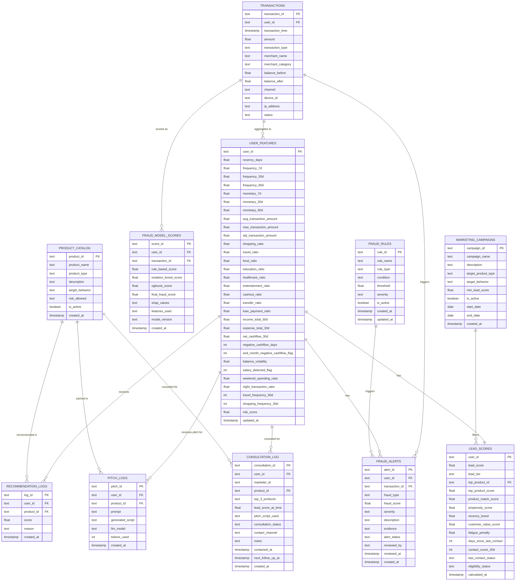
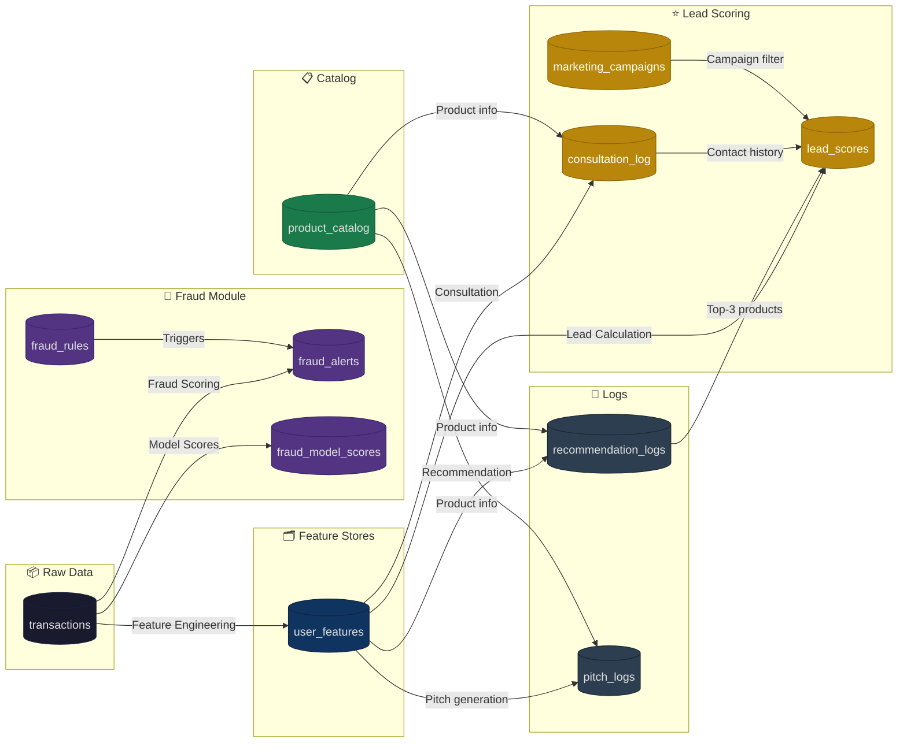

# Thiết kế cơ sở dữ liệu — AI Transaction Analyzer

> **Hệ thống: AI Phân tích Giao dịch Toàn diện — Phát hiện Gian lận & Khuyến nghị Sản phẩm Tài chính**

---

## 1. Sơ đồ quan hệ (ERD)



---

## 2. Chi tiết từng bảng

### 2.1. Bảng `transactions`

Bảng gốc — lưu toàn bộ giao dịch của hệ thống.

```sql
CREATE TABLE transactions (
    transaction_id      TEXT PRIMARY KEY,
    user_id             TEXT NOT NULL,
    transaction_time    TIMESTAMP NOT NULL,
    amount              FLOAT NOT NULL,
    transaction_type    TEXT,               -- 'transfer', 'payment', 'deposit', 'withdrawal', 'refund'
    merchant_name       TEXT,
    merchant_category   TEXT,               -- 'shopping', 'travel', 'food', 'healthcare', 'education', ...
    balance_before      FLOAT,
    balance_after       FLOAT,
    channel             TEXT,               -- 'mobile_app', 'web', 'atm', 'pos', 'bank_counter'
    device_id           TEXT,
    ip_address          TEXT,
    status              TEXT DEFAULT 'completed',  -- 'completed', 'pending', 'failed', 'reversed'
    
    created_at          TIMESTAMP DEFAULT CURRENT_TIMESTAMP
);

-- Indexes
CREATE INDEX idx_tx_user_id ON transactions(user_id);
CREATE INDEX idx_tx_time ON transactions(transaction_time DESC);
CREATE INDEX idx_tx_user_time ON transactions(user_id, transaction_time DESC);
CREATE INDEX idx_tx_category ON transactions(merchant_category);
CREATE INDEX idx_tx_device ON transactions(device_id);
CREATE INDEX idx_tx_status ON transactions(status);
```

| Cột | Kiểu | Mô tả |
|---|---|---|
| `transaction_id` | TEXT PK | Mã giao dịch duy nhất |
| `user_id` | TEXT NOT NULL | Mã khách hàng |
| `transaction_time` | TIMESTAMP | Thời gian giao dịch |
| `amount` | FLOAT | Số tiền giao dịch |
| `transaction_type` | TEXT | Loại giao dịch |
| `merchant_name` | TEXT | Tên merchant |
| `merchant_category` | TEXT | Danh mục chi tiêu |
| `balance_before` | FLOAT | Số dư trước giao dịch |
| `balance_after` | FLOAT | Số dư sau giao dịch |
| `channel` | TEXT | Kênh giao dịch |
| `device_id` | TEXT | Mã thiết bị |
| `ip_address` | TEXT | Địa chỉ IP |
| `status` | TEXT | Trạng thái giao dịch |

---

### 2.2. Bảng `user_features`

Bảng feature đã được tính sẵn cho mỗi user — dùng cho Recommendation + Lead Scoring.

```sql
CREATE TABLE user_features (
    user_id                         TEXT PRIMARY KEY,
    
    -- RFM Features
    recency_days                    FLOAT,      -- Số ngày từ giao dịch gần nhất
    frequency_7d                    INTEGER,    -- Số giao dịch 7 ngày
    frequency_30d                   INTEGER,    -- Số giao dịch 30 ngày
    frequency_90d                   INTEGER,    -- Số giao dịch 90 ngày
    monetary_7d                     FLOAT,      -- Tổng tiền 7 ngày
    monetary_30d                    FLOAT,      -- Tổng tiền 30 ngày
    monetary_90d                    FLOAT,      -- Tổng tiền 90 ngày
    avg_transaction_amount          FLOAT,      -- Giá trị giao dịch trung bình
    max_transaction_amount          FLOAT,      -- Giá trị giao dịch lớn nhất
    std_transaction_amount          FLOAT,      -- Độ lệch chuẩn giá trị
    
    -- Category Ratios (tỷ trọng 0-1)
    shopping_ratio                  FLOAT,
    travel_ratio                    FLOAT,
    food_ratio                      FLOAT,
    education_ratio                 FLOAT,
    healthcare_ratio                FLOAT,
    entertainment_ratio             FLOAT,
    cashout_ratio                   FLOAT,
    transfer_ratio                  FLOAT,
    loan_payment_ratio              FLOAT,
    
    -- Cashflow Features
    income_total_30d                FLOAT,
    expense_total_30d               FLOAT,
    net_cashflow_30d                FLOAT,      -- income - expense
    negative_cashflow_days          INTEGER,    -- Số ngày dòng tiền âm
    end_month_negative_cashflow_flag INTEGER,   -- 0/1: cuối tháng thiếu tiền
    balance_volatility              FLOAT,      -- Độ biến động số dư
    salary_detected_flag            INTEGER,    -- 0/1: phát hiện lương
    
    -- Behavior Cycle Features
    weekend_spending_ratio          FLOAT,
    night_transaction_ratio         FLOAT,
    travel_frequency_90d            INTEGER,    -- Số giao dịch du lịch 90 ngày
    shopping_frequency_30d          INTEGER,    -- Số giao dịch mua sắm 30 ngày
    
    -- Risk
    risk_score                      FLOAT,      -- Điểm rủi ro tín dụng (0-1)
    
    updated_at                      TIMESTAMP DEFAULT CURRENT_TIMESTAMP
);

CREATE INDEX idx_uf_recency ON user_features(recency_days);
CREATE INDEX idx_uf_monetary ON user_features(monetary_30d DESC);
CREATE INDEX idx_uf_risk ON user_features(risk_score);
```

---

### 2.3. Bảng `product_catalog`

Danh mục sản phẩm tài chính có thể gợi ý.

```sql
CREATE TABLE product_catalog (
    product_id          TEXT PRIMARY KEY,
    product_name        TEXT NOT NULL,
    product_type        TEXT NOT NULL,          -- 'credit_card', 'insurance', 'loan', 'saving'
    description         TEXT,
    target_behavior     TEXT,                   -- 'shopping_high', 'travel_high', 'negative_cashflow', ...
    risk_allowed        TEXT DEFAULT 'low',     -- 'low', 'medium', 'high'
    min_risk_score      FLOAT DEFAULT 0.0,
    max_risk_score      FLOAT DEFAULT 1.0,
    is_active           BOOLEAN DEFAULT TRUE,
    created_at          TIMESTAMP DEFAULT CURRENT_TIMESTAMP
);

CREATE INDEX idx_prod_type ON product_catalog(product_type);
CREATE INDEX idx_prod_active ON product_catalog(is_active);
```

**Dữ liệu mẫu:**

| product_id | product_name | product_type | target_behavior | risk_allowed |
|---|---|---|---|---|
| P001 | Thẻ tín dụng hoàn tiền | credit_card | shopping_high | medium |
| P002 | Bảo hiểm du lịch | insurance | travel_high | low |
| P003 | Vay tiêu dùng | loan | negative_cashflow | medium |
| P004 | Vay thấu chi | loan | end_month_cash_shortage | medium |
| P005 | Gói tiết kiệm linh hoạt | saving | positive_cashflow | low |
| P006 | Bảo hiểm sức khỏe | insurance | healthcare_high | low |

---

### 2.4. Bảng `fraud_alerts`

Lưu các cảnh báo gian lận được sinh ra từ Fraud Detection Engine.

```sql
CREATE TABLE fraud_alerts (
    alert_id            TEXT PRIMARY KEY,
    user_id             TEXT NOT NULL,
    transaction_id      TEXT,
    fraud_type          TEXT,                   -- 'account_takeover', 'money_mule', 'fake_identity', ...
    fraud_score         FLOAT NOT NULL,         -- 0-1
    severity            TEXT NOT NULL,          -- 'high', 'medium', 'low'
    description         TEXT,
    evidence            TEXT,                   -- JSON: danh sách bằng chứng ["device_change", "amount_spike", ...]
    alert_status        TEXT DEFAULT 'open',    -- 'open', 'confirmed', 'false_positive', 'resolved'
    reviewed_by         TEXT,                   -- Mã fraud analyst
    reviewed_at         TIMESTAMP,
    created_at          TIMESTAMP DEFAULT CURRENT_TIMESTAMP,
    
    FOREIGN KEY (user_id) REFERENCES user_features(user_id),
    FOREIGN KEY (transaction_id) REFERENCES transactions(transaction_id)
);

CREATE INDEX idx_fa_user ON fraud_alerts(user_id, created_at DESC);
CREATE INDEX idx_fa_status ON fraud_alerts(alert_status, severity);
CREATE INDEX idx_fa_score ON fraud_alerts(fraud_score DESC);
CREATE INDEX idx_fa_created ON fraud_alerts(created_at DESC);
```

---

### 2.5. Bảng `fraud_model_scores`

Lưu điểm chi tiết từ từng model để audit và debug.

```sql
CREATE TABLE fraud_model_scores (
    score_id                TEXT PRIMARY KEY,
    user_id                 TEXT NOT NULL,
    transaction_id          TEXT,
    rule_based_score        FLOAT,              -- Điểm từ rule-based (0-1)
    isolation_forest_score  FLOAT,              -- Điểm từ Isolation Forest (0-1)
    xgboost_score           FLOAT,              -- Điểm từ XGBoost (0-1)
    final_fraud_score       FLOAT NOT NULL,     -- Điểm tổng hợp cuối cùng (0-1)
    shap_values             TEXT,               -- JSON: {"amount_zscore": 0.35, "device_change": 0.28, ...}
    features_used           TEXT,               -- JSON: giá trị các feature đã dùng
    model_version           TEXT,               -- Phiên bản model
    created_at              TIMESTAMP DEFAULT CURRENT_TIMESTAMP,
    
    FOREIGN KEY (user_id) REFERENCES user_features(user_id),
    FOREIGN KEY (transaction_id) REFERENCES transactions(transaction_id)
);

CREATE INDEX idx_fms_user ON fraud_model_scores(user_id, created_at DESC);
CREATE INDEX idx_fms_tx ON fraud_model_scores(transaction_id);
CREATE INDEX idx_fms_score ON fraud_model_scores(final_fraud_score DESC);
```

---

### 2.6. Bảng `fraud_rules`

Cấu hình các rule phát hiện gian lận.

```sql
CREATE TABLE fraud_rules (
    rule_id         TEXT PRIMARY KEY,
    rule_name       TEXT NOT NULL,
    rule_type       TEXT NOT NULL,           -- 'velocity', 'amount', 'device', 'network', 'circular'
    condition       TEXT,                     -- Mô tả điều kiện (human-readable)
    threshold       FLOAT,                    -- Ngưỡng kích hoạt
    severity        TEXT DEFAULT 'medium',    -- 'high', 'medium', 'low'
    is_active       BOOLEAN DEFAULT TRUE,
    created_at      TIMESTAMP DEFAULT CURRENT_TIMESTAMP,
    updated_at      TIMESTAMP DEFAULT CURRENT_TIMESTAMP
);
```

**Dữ liệu mẫu:**

| rule_id | rule_name | rule_type | threshold | severity |
|---|---|---|---|---|
| R01 | Amount Spike | amount | 5.0 | high |
| R02 | High Velocity | velocity | 10 tx/h | high |
| R03 | Device Change Risk | device | 1 | medium |
| R04 | Night Large TX | amount | 20M VND | medium |
| R05 | Fast Cash-out | velocity | 10 min | high |
| R06 | Money Mule Suspect | network | 10 senders | high |
| R07 | Circular Transaction | circular | 0.8 | high |

---

### 2.7. Bảng `recommendation_logs`

Ghi nhận mỗi lần hệ thống gợi ý sản phẩm cho user.

```sql
CREATE TABLE recommendation_logs (
    log_id          TEXT PRIMARY KEY,
    user_id         TEXT NOT NULL,
    product_id      TEXT NOT NULL,
    score           FLOAT NOT NULL,            -- Điểm phù hợp (0-1)
    reason          TEXT,                       -- Lý do gợi ý
    fraud_score     FLOAT,                      -- Fraud score tại thời điểm gợi ý
    risk_score      FLOAT,                      -- Risk score tại thời điểm gợi ý
    created_at      TIMESTAMP DEFAULT CURRENT_TIMESTAMP,
    
    FOREIGN KEY (user_id) REFERENCES user_features(user_id),
    FOREIGN KEY (product_id) REFERENCES product_catalog(product_id)
);

CREATE INDEX idx_rl_user ON recommendation_logs(user_id, created_at DESC);
CREATE INDEX idx_rl_product ON recommendation_logs(product_id, created_at DESC);
```

---

### 2.8. Bảng `pitch_logs`

Ghi nhận mỗi lần LLM sinh kịch bản tư vấn.

```sql
CREATE TABLE pitch_logs (
    pitch_id            TEXT PRIMARY KEY,
    user_id             TEXT NOT NULL,
    product_id          TEXT NOT NULL,
    prompt              TEXT,                   -- Prompt đã gửi cho LLM
    generated_script    TEXT,                   -- Kịch bản LLM sinh ra
    llm_model           TEXT,                   -- 'deepseek-chat', 'gemini-1.5-flash', ...
    tokens_used         INTEGER,                -- Số token đã dùng
    latency_ms          INTEGER,                -- Thời gian phản hồi (ms)
    fraud_score         FLOAT,                  -- Fraud score tại thời điểm sinh
    created_at          TIMESTAMP DEFAULT CURRENT_TIMESTAMP,
    
    FOREIGN KEY (user_id) REFERENCES user_features(user_id),
    FOREIGN KEY (product_id) REFERENCES product_catalog(product_id)
);

CREATE INDEX idx_pl_user ON pitch_logs(user_id, created_at DESC);
CREATE INDEX idx_pl_model ON pitch_logs(llm_model, created_at DESC);
```

---

### 2.9. Bảng `consultation_log` ⭐

**Bảng quan trọng nhất cho Lead Scoring** — ghi nhận mỗi lần marketer tư vấn khách hàng.

```sql
CREATE TABLE consultation_log (
    consultation_id         TEXT PRIMARY KEY,
    user_id                 TEXT NOT NULL,
    marketer_id             TEXT,               -- Mã nhân viên tiếp thị
    product_id              TEXT,               -- Sản phẩm được tư vấn
    top_3_products          TEXT,               -- JSON: ["P002", "P001", "P005"]
    lead_score_at_time      FLOAT,              -- Lead score tại thời điểm tư vấn
    pitch_script_used       TEXT,               -- Kịch bản đã dùng
    consultation_status     TEXT DEFAULT 'pending',  -- 'pending', 'contacted', 'interested', 'not_interested', 'converted', 'no_answer'
    contact_channel         TEXT,               -- 'phone', 'email', 'sms', 'in_person'
    notes                   TEXT,               -- Ghi chú từ marketer
    contacted_at            TIMESTAMP,          -- Thời điểm liên hệ thực tế
    next_follow_up_at       TIMESTAMP,          -- Lịch follow-up
    created_at              TIMESTAMP DEFAULT CURRENT_TIMESTAMP,
    
    FOREIGN KEY (user_id) REFERENCES user_features(user_id),
    FOREIGN KEY (product_id) REFERENCES product_catalog(product_id)
);

-- Indexes quan trọng cho Lead Scoring
CREATE INDEX idx_cl_user ON consultation_log(user_id, contacted_at DESC);
CREATE INDEX idx_cl_marketer ON consultation_log(marketer_id, contacted_at DESC);
CREATE INDEX idx_cl_status ON consultation_log(consultation_status, contacted_at DESC);
CREATE INDEX idx_cl_followup ON consultation_log(next_follow_up_at) 
    WHERE next_follow_up_at IS NOT NULL;
```

| Cột | Mô tả |
|---|---|
| `consultation_id` | Mã lần tư vấn |
| `user_id` | Khách hàng được tư vấn |
| `marketer_id` | Nhân viên thực hiện |
| `product_id` | Sản phẩm chính được tư vấn |
| `top_3_products` | JSON 3 sản phẩm được gợi ý lúc đó |
| `lead_score_at_time` | Lead score tại thời điểm tư vấn |
| `consultation_status` | Trạng thái sau tư vấn |
| `contact_channel` | Kênh liên hệ |
| `next_follow_up_at` | Lịch hẹn gọi lại |

---

### 2.10. Bảng `lead_scores` ⭐

Bảng tính sẵn lead_score cho từng user — truy vấn nhanh cho Lead Queue.

```sql
CREATE TABLE lead_scores (
    user_id                     TEXT PRIMARY KEY,
    lead_score                  FLOAT NOT NULL,         -- 0-1
    lead_tier                   TEXT,                   -- 'hot' (>0.85), 'warm' (0.6-0.85), 'cold' (<0.6)
    
    -- Top Product
    top_product_id              TEXT,                   -- Sản phẩm có score cao nhất
    top_product_score           FLOAT,                  -- Score của sản phẩm đó
    
    -- Score Components
    product_match_score         FLOAT,                  -- w1 × max(top-3 score)
    propensity_score            FLOAT,                  -- w2 × nhu cầu
    recency_boost               FLOAT,                  -- w3 × thời gian chưa liên hệ
    customer_value_score        FLOAT,                  -- w4 × giá trị khách hàng
    fatigue_penalty             FLOAT,                  -- w5 × tần suất liên hệ
    
    -- Contact Info
    days_since_last_contact     INTEGER,                -- NULL nếu chưa từng
    contact_count_30d           INTEGER DEFAULT 0,
    last_contact_status         TEXT,                   -- Trạng thái lần gần nhất
    
    -- Eligibility
    eligibility_status          TEXT DEFAULT 'eligible', -- 'eligible', 'fraud_blocked', 'recently_rejected', 'over_contacted'
    
    calculated_at               TIMESTAMP DEFAULT CURRENT_TIMESTAMP,
    
    FOREIGN KEY (user_id) REFERENCES user_features(user_id),
    FOREIGN KEY (top_product_id) REFERENCES product_catalog(product_id)
);

-- Indexes cực kỳ quan trọng cho Lead Queue performance
CREATE INDEX idx_ls_score ON lead_scores(lead_score DESC);
CREATE INDEX idx_ls_tier ON lead_scores(lead_tier, lead_score DESC);
CREATE INDEX idx_ls_eligibility ON lead_scores(eligibility_status, lead_score DESC);
CREATE INDEX idx_ls_product ON lead_scores(top_product_id, lead_score DESC);
CREATE INDEX idx_ls_calculated ON lead_scores(calculated_at DESC);
```

**Công thức Lead Score:**

```text
LEAD_SCORE = 0.30 × product_match_score
           + 0.25 × propensity_score
           + 0.20 × recency_boost
           + 0.15 × customer_value_score
           − 0.10 × fatigue_penalty
```

**Phân loại Lead Tier:**

| Tier | Điều kiện | Hành động |
|---|---|---|
| 🔥 **Hot** | `lead_score > 0.85` | Gọi ngay — ưu tiên cao nhất |
| 🟡 **Warm** | `0.6 ≤ lead_score ≤ 0.85` | Gọi trong tuần |
| 🔵 **Cold** | `lead_score < 0.6` | Gọi khi rảnh / chiến dịch đặc biệt |

---

### 2.11. Bảng `marketing_campaigns`

Cấu hình chiến dịch marketing để filter Lead Queue.

```sql
CREATE TABLE marketing_campaigns (
    campaign_id             TEXT PRIMARY KEY,
    campaign_name           TEXT NOT NULL,
    description             TEXT,
    target_product_type     TEXT,                   -- 'insurance', 'credit_card', 'loan', 'saving'
    target_behavior         TEXT,                   -- VD: "travel_ratio > 0.2 AND travel_frequency > 2"
    min_lead_score          FLOAT DEFAULT 0.6,
    is_active               BOOLEAN DEFAULT TRUE,
    start_date              DATE,
    end_date                DATE,
    created_at              TIMESTAMP DEFAULT CURRENT_TIMESTAMP
);

CREATE INDEX idx_camp_active ON marketing_campaigns(is_active, start_date, end_date);
```

**Dữ liệu mẫu:**

| campaign_id | campaign_name | target_product_type | min_lead_score |
|---|---|---|---|
| CAMP001 | Du lịch hè 2024 | insurance | 0.70 |
| CAMP002 | Tài chính cuối năm | loan | 0.60 |
| CAMP003 | Back to school | saving | 0.65 |

---

## 3. Sơ đồ luồng dữ liệu giữa các bảng



---

## 4. Các câu truy vấn quan trọng

### 4.1. Lấy Lead Queue (xếp hạng user ưu tiên)

```sql
SELECT 
    ls.user_id,
    ls.lead_score,
    ls.lead_tier,
    ls.product_match_score,
    ls.propensity_score,
    ls.recency_boost,
    ls.customer_value_score,
    ls.fatigue_penalty,
    ls.days_since_last_contact,
    ls.contact_count_30d,
    pc.product_name AS top_product_name,
    pc.product_type AS top_product_type,
    ls.top_product_score
FROM lead_scores ls
LEFT JOIN product_catalog pc ON ls.top_product_id = pc.product_id
WHERE ls.eligibility_status = 'eligible'
  AND ls.lead_score >= 0.6
  AND ls.lead_tier = 'hot'
ORDER BY ls.lead_score DESC
LIMIT 50 OFFSET 0;
```

### 4.2. Lấy lịch sử tư vấn của một user

```sql
SELECT 
    cl.consultation_id,
    cl.consultation_status,
    cl.contact_channel,
    cl.contacted_at,
    cl.next_follow_up_at,
    cl.notes,
    cl.marketer_id,
    pc.product_name,
    cl.lead_score_at_time
FROM consultation_log cl
LEFT JOIN product_catalog pc ON cl.product_id = pc.product_id
WHERE cl.user_id = 'U0042'
ORDER BY cl.contacted_at DESC;
```

### 4.3. Tính contact_count_30d cho Lead Score

```sql
SELECT 
    user_id,
    COUNT(*) AS contact_count_30d
FROM consultation_log
WHERE contacted_at >= NOW() - INTERVAL '30 days'
  AND consultation_status IN ('contacted', 'interested', 'converted', 'not_interested')
GROUP BY user_id;
```

### 4.4. Tính days_since_last_contact cho Lead Score

```sql
SELECT 
    user_id,
    EXTRACT(DAY FROM (NOW() - MAX(contacted_at))) AS days_since_last_contact,
    MAX(contacted_at) AS last_contacted_at
FROM consultation_log
WHERE consultation_status IN ('contacted', 'interested', 'converted', 'not_interested')
GROUP BY user_id;
```

### 4.5. Fraud alerts đang mở (cần analyst xử lý)

```sql
SELECT 
    fa.alert_id,
    fa.user_id,
    fa.fraud_type,
    fa.severity,
    fa.fraud_score,
    fa.description,
    fa.created_at,
    t.amount,
    t.transaction_type
FROM fraud_alerts fa
LEFT JOIN transactions t ON fa.transaction_id = t.transaction_id
WHERE fa.alert_status = 'open'
ORDER BY fa.severity DESC, fa.fraud_score DESC
LIMIT 100;
```

### 4.6. Thống kê hiệu quả Lead Queue

```sql
SELECT 
    ls.lead_tier,
    COUNT(DISTINCT cl.user_id) AS contacted_users,
    COUNT(DISTINCT CASE WHEN cl.consultation_status = 'converted' THEN cl.user_id END) AS converted_users,
    ROUND(
        COUNT(DISTINCT CASE WHEN cl.consultation_status = 'converted' THEN cl.user_id END)::FLOAT 
        / NULLIF(COUNT(DISTINCT cl.user_id), 0) * 100, 1
    ) AS conversion_rate_pct
FROM lead_scores ls
LEFT JOIN consultation_log cl ON ls.user_id = cl.user_id 
    AND cl.contacted_at >= NOW() - INTERVAL '30 days'
WHERE ls.eligibility_status = 'eligible'
GROUP BY ls.lead_tier
ORDER BY ls.lead_tier;
```

---

## 5. Chiến lược Index

| Bảng | Index | Mục đích |
|---|---|---|
| `transactions` | `(user_id, transaction_time DESC)` | Truy vấn lịch sử user |
| `transactions` | `(device_id)` | Phát hiện multi-account |
| `fraud_alerts` | `(alert_status, severity)` | Lọc alert đang mở |
| `fraud_alerts` | `(user_id, created_at DESC)` | Lịch sử fraud của user |
| `fraud_model_scores` | `(final_fraud_score DESC)` | Top giao dịch đáng ngờ |
| `lead_scores` | `(eligibility_status, lead_score DESC)` | **Lead Queue — query chính** |
| `lead_scores` | `(top_product_id, lead_score DESC)` | Lead Queue theo sản phẩm |
| `consultation_log` | `(user_id, contacted_at DESC)` | Lịch sử tư vấn |
| `consultation_log` | `(next_follow_up_at) WHERE NOT NULL` | Nhắc follow-up |

---

## 6. Backup & Retention Policy

| Bảng | Retention | Backup |
|---|---|---|
| `transactions` | 5 năm (quy định tài chính) | Daily incremental + Weekly full |
| `fraud_alerts` | 2 năm | Weekly full |
| `fraud_model_scores` | 1 năm | Weekly full |
| `consultation_log` | 3 năm | Weekly full |
| `lead_scores` | Tính lại mỗi ngày (không cần backup) | — |
| `pitch_logs` | 1 năm | Weekly full |
| `recommendation_logs` | 1 năm | Weekly full |
