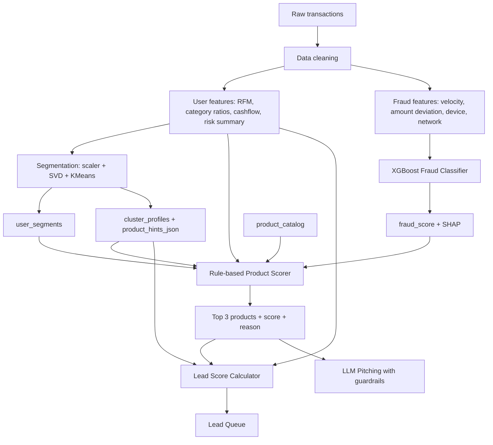

# Kế hoạch hệ thống AI phân tích giao dịch

Tài liệu này mô tả kế hoạch MVP hiện tại sau khi bỏ hướng Recommendation dựa trên dataset sản phẩm theo tháng và các mô hình xếp hạng cũ. Tầng Recommendation mới dùng dữ liệu giao dịch, đặc trưng hành vi, phân cụm khách hàng và danh mục sản phẩm để tạo Top 3 sản phẩm tài chính cá nhân hóa.

---

## 1. Mục tiêu MVP

Hệ thống có 4 năng lực chính:

1. **Fraud Detection Engine**: chấm `fraud_score` từ dữ liệu giao dịch bằng XGBoost, giải thích bằng SHAP và tạo cảnh báo khi cần.
2. **Customer Segmentation Engine**: phân cụm khách hàng từ `user_features` bằng `StandardScaler -> TruncatedSVD -> KMeans`, lưu `user_segments` và `cluster_profiles` theo `model_version`.
3. **Rule-Based Recommendation Engine**: tạo Top 3 sản phẩm từ `product_catalog` bằng `score_product(user, product, cluster_profile, fraud_score)`.
4. **Lead Scoring & Pitching**: tính `lead_score`, xếp Lead Queue và sinh kịch bản tư vấn có guardrails.

Luồng Recommendation chính:

```text
transactions
  -> user_features
  -> user_segments + cluster_profiles.product_hints
  -> product_catalog
  -> score_product()
  -> top 3 products + reasons
  -> lead_score
  -> lead_queue / pitching
```

---

## 2. Kiến trúc tổng thể



---

## 3. Dữ liệu đầu vào

### 3.1. `transactions`

Dữ liệu giao dịch thô dùng cho cả Fraud, Recommendation và Segmentation:

```text
transaction_id
user_id
timestamp
amount
transaction_type
merchant_category
merchant_name
channel
device_id
ip_address
location
is_fraud
```

### 3.2. `user_features`

Ma trận đặc trưng theo khách hàng (31 features), cập nhật định kỳ. Schema khớp với bảng `user_features` trong DATABASE.md và REPORT-DATASET-SELECTION-v3.md:

```text
user_id

-- RFM Features (10)
recency_days
frequency_7d
frequency_30d
frequency_90d
monetary_7d
monetary_30d
monetary_90d
avg_transaction_amount
max_transaction_amount
std_transaction_amount

-- Category Ratios (9)
shopping_ratio
travel_ratio
food_ratio
education_ratio
healthcare_ratio
entertainment_ratio
cashout_ratio
transfer_ratio
loan_payment_ratio

-- Cashflow Features (7)
income_total_30d
expense_total_30d
net_cashflow_30d
negative_cashflow_days
end_month_negative_cashflow_flag
balance_volatility
salary_detected_flag

-- Behavior Cycle Features (4)
weekend_spending_ratio
night_transaction_ratio
travel_frequency_90d
shopping_frequency_30d

-- Risk (1)
risk_score

updated_at
```

Các nhóm feature quan trọng:

| Nhóm | Số lượng | Vai trò |
|---|---|---|
| RFM | 10 | Đo mức hoạt động và giá trị gần đây |
| Category ratios | 9 | Tín hiệu chính cho `behavior_match` |
| Cashflow | 7 | Đo khả năng chi trả, nhu cầu vay, tiết kiệm |
| Behavior Cycle | 4 | Mẫu hành vi theo thời gian: cuối tuần, ban đêm, tần suất du lịch/mua sắm |
| Risk | 1 | Gatekeeper trước khi gợi ý sản phẩm |

> **Lưu ý:** Các tín hiệu vận hành sau **không nằm trong bảng `user_features`** mà được truy vấn từ bảng khác tại thời điểm serving:
>
> | Tín hiệu | Nguồn |
> |---|---|
> | `fraud_score_latest` | `fraud_model_scores` — lấy score mới nhất theo `user_id` |
> | Sản phẩm đã sở hữu | `recommendation_logs` / `consultation_log` — lọc `converted` |
> | `last_recommendation_at` | `recommendation_logs` — `MAX(created_at)` |
> | `last_reject_at` | `consultation_log` — `MAX(contacted_at)` WHERE `status = 'not_interested'` |
> | `contact_count_30d` | `consultation_log` — `COUNT(*)` trong 30 ngày |

---

## 4. Customer Segmentation

Segmentation không quyết định trực tiếp Top 3. Nó cung cấp ngữ cảnh nhóm khách hàng để tăng/giảm điểm sản phẩm.

Pipeline:

```text
user_features
  -> select stable behavioral features
  -> StandardScaler
  -> TruncatedSVD
  -> KMeans
  -> user_segments + cluster_profiles
```

Artifacts:

```text
models/segmentation/<model_version>/scaler.pkl
models/segmentation/<model_version>/svd.pkl
models/segmentation/<model_version>/kmeans.pkl
models/segmentation/<model_version>/feature_schema.json
models/segmentation/<model_version>/cluster_profiles.json
```

`cluster_profiles.product_hints_json` dùng schema:

```json
[
  {
    "product_id": "P002",
    "affinity": 0.86,
    "confidence": 0.78,
    "positive_signals": ["travel_ratio_high", "online_spend_high"],
    "reason": "Cụm này có chi tiêu du lịch và thanh toán online nổi bật"
  }
]
```

Guardrail dữ liệu: LLM chỉ được nhận aggregate profile theo cụm như size, ratio, top z-score features, centroid similarity và product hints. Không gửi raw transaction, PII, card number, IP hoặc device fingerprint.

---

## 5. Recommendation Layer

### 5.1. Vai trò

Recommendation Engine nhận `user_id`, đọc profile khách hàng, fraud profile, segment context và `product_catalog`, sau đó trả về Top 3 sản phẩm tài chính phù hợp nhất.

Không map cứng `cluster_id -> top 3`. Cụm chỉ là một phần của điểm. Quyết định cuối cùng luôn chạy ở cấp từng cặp `(user, product)`.

### 5.2. Product Catalog

`product_catalog` là source of truth cho sản phẩm có thể tiếp thị:

```text
product_id
product_name
product_type
description
risk_allowed
target_behavior
target_signals_json
eligibility_json
campaign_priority
reason_template
is_active
```

Sản phẩm MVP:

| product_id | product_name | product_type | risk_allowed | target_behavior |
|---|---|---|---|---|
| P001 | Thẻ tín dụng hoàn tiền | credit_card | medium | shopping_high |
| P002 | Bảo hiểm du lịch | insurance | low | travel_high |
| P003 | Vay tiêu dùng | loan | medium | negative_cashflow |
| P004 | Vay thấu chi | loan | medium | end_month_cash_shortage |
| P005 | Gói tiết kiệm linh hoạt | saving | low | positive_cashflow |
| P006 | Bảo hiểm sức khỏe | insurance | low | healthcare_high |

### 5.3. Hard Filters

Chạy trước khi tính điểm:

```text
fraud_score >= 0.7                   -> không gợi ý sản phẩm nào
0.3 <= fraud_score < 0.7              -> chỉ giữ sản phẩm risk_allowed = low
product.is_active = false             -> loại
user đã sở hữu sản phẩm               -> loại
không đạt eligibility_json            -> loại
đang cooldown sau reject              -> loại hoặc trừ fatigue
```

### 5.4. Scoring

Hàm chính:

```text
score_product(user, product, cluster_profile, fraud_score) -> RecommendationCandidate
```

Công thức MVP:

```text
rec_score =
0.40 * behavior_match
+ 0.25 * segment_affinity
+ 0.20 * affordability_fit
+ 0.10 * timing_need
+ 0.05 * campaign_priority
```

Default scoring:

| Thành phần | Cách tính |
|---|---|
| `behavior_match` | Weighted sum từ `target_signals_json` và `user_features` (category ratios, behavior cycle); nếu thiếu `target_signals_json` dùng `0.00` |
| `segment_affinity` | Lấy từ `cluster_profiles.product_hints_json`; nếu thiếu dùng `0.35` |
| `affordability_fit` | Dựa trên `income_total_30d`, `net_cashflow_30d`, `balance_volatility`, `risk_score`; nếu thiếu dùng `0.50` |
| `timing_need` | Dựa trên tín hiệu 30-90 ngày gần nhất (`travel_frequency_90d`, `shopping_frequency_30d`, `negative_cashflow_days`...); nếu thiếu dùng `0.40` |
| `campaign_priority` | Normalize 0-1; nếu thiếu dùng `0.50` |

Sau khi tính điểm toàn bộ candidate:

```text
sort by rec_score DESC
tie-break by campaign_priority DESC
tie-break by product_id ASC
take top 3
```

### 5.5. Reason Generation

Mỗi sản phẩm cần 2-3 lý do ngắn, lấy từ các thành phần có đóng góp cao nhất trong `score_breakdown`. Không tạo reason từ tín hiệu điểm thấp hoặc dữ liệu thiếu.

Ví dụ:

```text
- Chi tiêu du lịch cao trong 90 ngày gần đây.
- Cụm khách hàng này có affinity cao với bảo hiểm du lịch.
- Dòng tiền ổn định, phù hợp với sản phẩm có phí định kỳ thấp.
```

### 5.6. API Response

```json
{
  "user_id": "U123",
  "segment": {
    "cluster_id": 2,
    "cluster_name": "Travel Affluent"
  },
  "recommendations": [
    {
      "product_id": "P002",
      "product_name": "Bảo hiểm du lịch",
      "score": 0.87,
      "score_breakdown": {
        "behavior_match": 0.36,
        "segment_affinity": 0.22,
        "affordability_fit": 0.17,
        "timing_need": 0.08,
        "campaign_priority": 0.04
      },
      "reasons": [
        "Chi tiêu du lịch cao",
        "Cụm khách hàng có affinity cao với sản phẩm này"
      ]
    }
  ],
  "eligibility_status": "eligible"
}
```

Nếu `fraud_score >= 0.7`:

```json
{
  "user_id": "U123",
  "recommendations": [],
  "eligibility_status": "blocked_fraud",
  "message": "Tài khoản bị cảnh báo gian lận, không gợi ý sản phẩm."
}
```

---

## 6. Lead Scoring

Recommendation trả lời "nên chào sản phẩm gì". Lead Scoring trả lời "nên ưu tiên gọi ai trước".

Công thức:

```text
lead_score =
0.30 * product_match_score
+ 0.25 * propensity_score
+ 0.20 * recency_score
+ 0.15 * customer_value_score
- 0.10 * fatigue_score
```

Component definitions:

| Thành phần | Nguồn |
|---|---|
| `product_match_score` | Score cao nhất trong Top 3 |
| `propensity_score` | Mức phù hợp tổng hợp từ behavior, segment affinity, lịch sử tương tác |
| `recency_score` | Thời gian từ lần liên hệ gần nhất |
| `customer_value_score` | Monetary, income estimate, độ sâu quan hệ |
| `fatigue_score` | Số lần gọi 30 ngày, reject gần nhất, cooldown |

Lead tier:

| Tier | Điều kiện | Hành động |
|---|---|---|
| Hot | `lead_score > 0.85` | Gọi ngay |
| Warm | `0.60 <= lead_score <= 0.85` | Gọi trong tuần |
| Cold | `lead_score < 0.60` | Gọi khi có chiến dịch phù hợp |

---

## 7. Agent Flow

```text
Data Agent
  -> lấy user_features, segment, cluster_profile, product_catalog
Fraud Agent
  -> lấy fraud_score mới nhất
Recommendation Agent
  -> chạy hard filters + score_product + top 3
Lead Score Agent
  -> tính lead_score và cập nhật lead_scores
Pitching Agent
  -> chỉ chạy nếu fraud_score < 0.3
Response Formatter
  -> chuẩn hóa JSON cho frontend
```

Guardrails:

```text
fraud_score >= 0.7:
    dừng Recommendation và Pitching

0.3 <= fraud_score < 0.7:
    Recommendation chỉ giữ sản phẩm low-risk
    không sinh pitch

fraud_score < 0.3:
    Recommendation đầy đủ
    Pitching được phép chạy
```

---

## 8. Database Tables

Core tables:

```text
transactions
user_features
product_catalog
fraud_alerts
fraud_model_scores
fraud_rules
recommendation_logs
pitch_logs
consultation_log
lead_scores
segmentation_model_versions
user_segments
cluster_profiles
segmentation_runs
marketing_campaigns
```

`recommendation_logs` cần lưu:

```text
user_id
product_id
score
score_breakdown_json
reason_json
fraud_score
risk_score
model_version
created_at
```

`lead_scores` cần lưu:

```text
user_id
lead_score
lead_tier
top_product_id
top_product_score
product_match_score
propensity_score
recency_score
customer_value_score
fatigue_score
eligibility_status
calculated_at
```

---

## 9. API Interfaces

### `GET /users/{user_id}/recommendations`

Trả Top 3 sản phẩm đã lọc theo fraud/risk và đã có reasons.

Query params:

```text
limit=3
include_score_breakdown=true
```

### `POST /recommendations/recalculate-lead-scores`

Tính lại `lead_scores` cho batch user hoặc toàn bộ user active.

### `GET /recommendations/lead-queue`

Query Lead Queue:

```text
tier=hot|warm|cold
product_type=credit_card|insurance|loan|saving
product_id=P002
min_lead_score=0.6
limit=50
offset=0
sort_by=lead_score|recency|value
```

### `POST /recommendations/interaction`

Ghi nhận tương tác:

```json
{
  "user_id": "U123",
  "product_id": "P002",
  "interaction_type": "view",
  "metadata": {
    "source": "dashboard",
    "rank": 1
  }
}
```

Các `interaction_type` hợp lệ:

```text
view
click
pitch_generated
contacted
accepted
rejected
no_answer
converted
```

> **Phân biệt với `POST /recommendations/mark-consulted`:** Endpoint `interaction` ghi nhận **sự kiện nhẹ** (view, click, pitch_generated) phục vụ telemetry và huấn luyện ML. Endpoint `mark-consulted` (trong STRUCTURE.md) ghi nhận **kết quả tư vấn chi tiết** vào bảng `consultation_log` (status, notes, marketer_id, follow-up) phục vụ Lead Scoring và quản lý telesales. Các `interaction_type` nặng như `contacted`, `accepted`, `rejected`, `converted` cũng nên được ghi song song vào `consultation_log` qua `mark-consulted`.

---

## 10. Project Structure

```text
src/
  fraud/
    feature_builder.py
    xgboost_model.py
    shap_explainer.py
    service.py
  segmentation/
    feature_selection.py
    pipeline.py
    profiling.py
    service.py
  recommender/
    product_catalog.py
    rule_based.py
    reason_generator.py
    service.py
  lead_scoring/
    lead_score.py
    propensity.py
    campaign.py
  agents/
    data_agent.py
    fraud_agent.py
    segmentation_agent.py
    recommendation_agent.py
    lead_score_agent.py
    pitching_agent.py
  api/
    fraud_routes.py
    segmentation_routes.py
    recommendation_routes.py
```

Artifacts:

```text
models/
  fraud/
    xgboost_model.pkl
    shap_explainer.pkl
  segmentation/
    <model_version>/
      scaler.pkl
      svd.pkl
      kmeans.pkl
      feature_schema.json
      cluster_profiles.json
configs/
  product_catalog.json
  lead_score_weights.json
  campaigns.json
```

---

## 11. Implementation Roadmap

### Tuần 1: Data + Product Catalog

- Làm sạch transaction data.
- Tạo `user_features` từ RFM, category ratios, cashflow, risk/fraud summary.
- Tạo seed `product_catalog` cho 6 sản phẩm MVP.
- Tạo `target_signals_json`, `eligibility_json`, `campaign_priority`, `reason_template`.

### Tuần 2: Fraud + Segmentation

- Train XGBoost Fraud Classifier và SHAP Explainer.
- Train Segmentation Pipeline.
- Sinh `user_segments` và `cluster_profiles`.
- Sinh `product_hints_json` từ aggregate cluster profile.

### Tuần 3: Recommendation

- Xây `score_product()`.
- Xây hard filters theo fraud/risk/ownership/eligibility/cooldown.
- Xây reason generator.
- Ghi `recommendation_logs`.
- Tạo API `GET /users/{user_id}/recommendations`.

### Tuần 4: Lead Queue + Pitching

- Xây `compute_lead_score()`.
- Tạo `lead_scores` và API Lead Queue.
- Tạo interaction logging.
- Tạo Pitching Agent và guardrails.

### Tuần 5-6: Dashboard + Testing

- Dashboard 2 tab: Fraud Detection và Recommendation.
- Lead Queue cho telesales.
- Customer detail hiển thị segment badge, Top 3 products, reasons, lead score breakdown.
- End-to-end tests cho fraud gate, recommendation, lead queue, pitching.

---

## 12. Acceptance Tests

Recommendation tests:

- User có `fraud_score >= 0.7` trả empty recommendations và `eligibility_status = blocked_fraud`.
- User có `0.3 <= fraud_score < 0.7` chỉ nhận sản phẩm `risk_allowed = low`.
- Sản phẩm user đã sở hữu không xuất hiện trong Top 3.
- Cụm có `product_hints_json.affinity` cao làm sản phẩm tương ứng tăng hạng nhưng không vượt hard filter.
- User thiếu segment vẫn có recommendation dựa trên behavior với default `segment_affinity`.
- Reason phải khớp với các điểm cao nhất trong `score_breakdown`.
- Ranking deterministic khi hai sản phẩm có cùng score.
- Lead score được tính sau Top 3 và phân tier đúng.

System tests:

- Recommendation API latency < 2 giây.
- Lead Queue API latency < 500ms với index trên `lead_scores`.
- Không gửi PII/raw transaction sang LLM.
- Không sinh pitch nếu `fraud_score >= 0.3`.

---

## 13. Nguyên tắc thiết kế

1. Segmentation giúp hiểu nhóm khách hàng, nhưng không thay thế user-level scoring.
2. Product catalog là source of truth cho điều kiện, risk và tín hiệu sản phẩm.
3. Recommendation phải explainable: mọi Top 3 cần có score breakdown và reasons.
4. Fraud score là gatekeeper ở tầng serving.
5. Tương tác telesales phải được log để cải thiện scoring trong các phiên bản sau.
