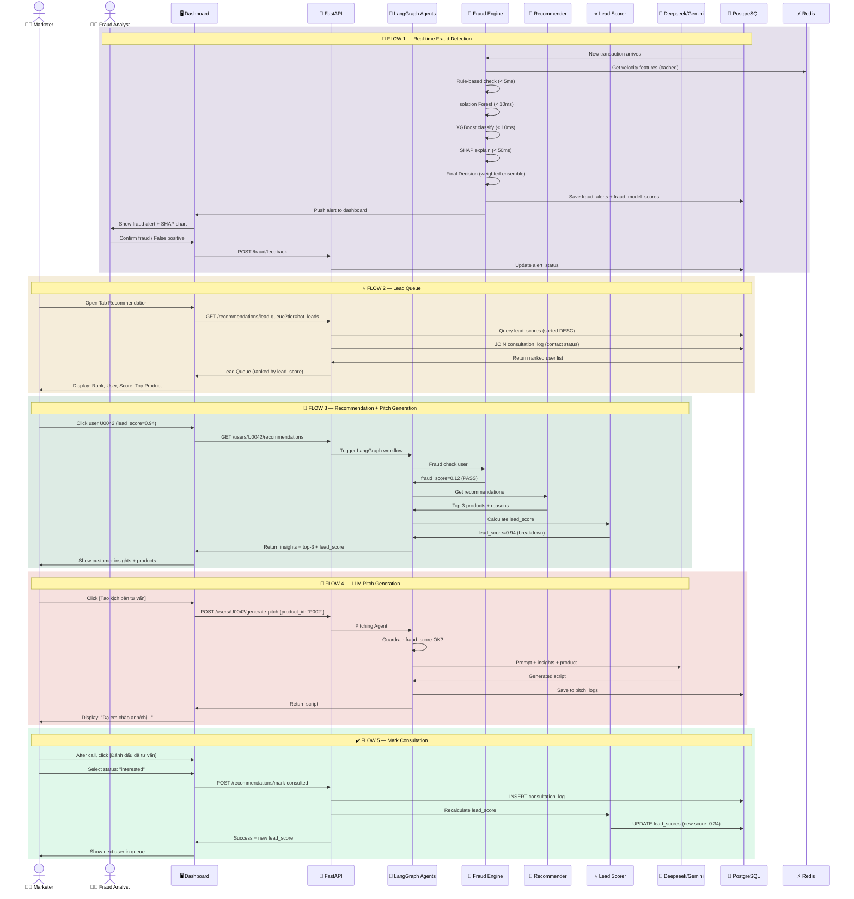
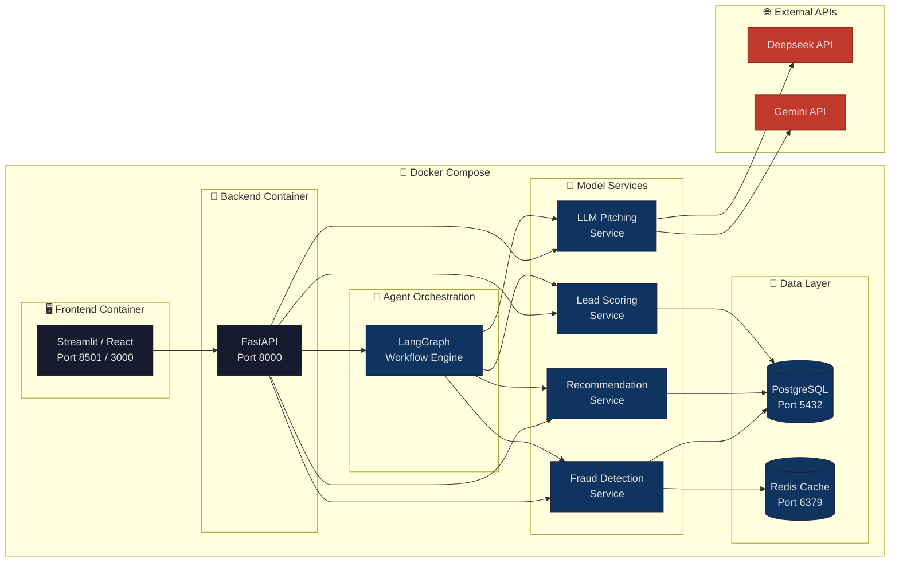

# Plan chi tiết cho hệ thống phát hiện gian lận và khuyến nghị sản phẩm tài chính

Dựa trên kế hoạch 6 tuần trong file project, hệ thống cần hoàn thành 3 đầu ra chính:

1. **Fraud Detection Engine**: phát hiện giao dịch gian lận theo thời gian thực, trả về `fraud_score` và `fraud_alerts`.
2. **Recommendation Engine**: gợi ý Top 3 sản phẩm tài chính phù hợp với khách hàng (chỉ cho khách hàng không bị flag gian lận).
3. **LLM Pitching Bot**: sinh kịch bản tư vấn khi nhân viên bấm nút **"Tạo kịch bản tư vấn"**.

---

## Sơ đồ kiến trúc tổng thể

```mermaid
flowchart TB
    %% ── Styles ──
    classDef datasource fill:#1a1a2e,stroke:#16213e,color:#e0e0e0
    classDef datalayer fill:#0f3460,stroke:#16213e,color:#e0e0e0
    classDef fraudlayer fill:#533483,stroke:#3a2568,color:#e0e0e0
    classDef reclayer fill:#1b7a4a,stroke:#145c38,color:#e0e0e0
    classDef leadlayer fill:#b8860b,stroke:#8b6508,color:#fff
    classDef llmlayer fill:#c0392b,stroke:#922b21,color:#e0e0e0
    classDef agentlayer fill:#2c3e50,stroke:#1a252f,color:#e0e0e0
    classDef apilayer fill:#2471a3,stroke:#1a5276,color:#e0e0e0
    classDef dashboard fill:#1a1a2e,stroke:#16213e,color:#e0e0e0
    classDef db fill:#34495e,stroke:#2c3e50,color:#e0e0e0
    classDef decision fill:#e67e22,stroke:#d35400,color:#fff
    classDef block fill:#c0392b,stroke:#922b21,color:#fff

    %% ── Data Sources ──
    subgraph DATA_SRC["📦 DATA SOURCES"]
        direction TB
        raw_db[("🗄️ Raw Transaction DB<br/>(transaction_id, user_id,<br/>amount, merchant_category,<br/>device_id, ip_address, ...)")]
    end

    %% ── Layer 1: Data Preparation ──
    subgraph L1["🔧 LAYER 1 — Data Preparation"]
        direction TB
        cleaning["🧹 Data Cleaning<br/><i>Drop duplicates, normalize<br/>categories, handle missing</i>"]
        feat_eng["⚙️ Feature Engineering<br/><i>RFM + Category Ratio<br/>+ Cashflow + Cycle</i>"]
        fraud_feat["⚙️ Fraud Feature Engineering<br/><i>Velocity + Behavioral Deviation<br/>+ Device/Channel + Graph</i>"]

        cleaning --> feat_eng
        cleaning --> fraud_feat
    end

    %% ── Feature Stores ──
    subgraph FEAT_STORE["🗂️ FEATURE STORES"]
        direction LR
        user_feat[("📊 User-Feature<br/>Matrix")]
        fraud_feat_store[("🔴 Fraud-Feature<br/>Matrix")]
    end

    feat_eng --> user_feat
    fraud_feat --> fraud_feat_store

    %% ── Layer 2: Fraud Detection ──
    subgraph L2["🚨 LAYER 2 — Fraud Detection Engine"]
        direction TB
        rule_fraud["📏 Rule-based Filter<br/><i>7 Hard Rules<br/>(Amount Spike, Velocity,<br/>Device Change, Fast Cash-out,<br/>Many-to-One, Circular...)</i>"]
        iso_forest["🌲 Isolation Forest<br/><i>Unsupervised Anomaly<br/>Detection</i>"]
        xgboost["🚀 XGBoost Classifier<br/><i>Supervised Fraud<br/>Classification + SMOTE</i>"]
        shap["🔍 SHAP Explainer<br/><i>Explainable AI —<br/>Top Contributing Features</i>"]
        decision["⚡ Final Decision Engine<br/><i>Weighted Ensemble<br/>(Rule + IF + XGBoost)</i>"]

        rule_fraud --> decision
        iso_forest --> decision
        xgboost --> decision
        decision --> shap
    end

    fraud_feat_store --> rule_fraud
    fraud_feat_store --> iso_forest
    fraud_feat_store --> xgboost

    %% ── Decision Gate ──
    decision_gate{"🛑 FRAUD GATE<br/>fraud_score?"}
    decision --> decision_gate

    %% ── Layer 3: Recommendation ──
    subgraph L3["🎯 LAYER 3 — Recommendation Engine"]
        direction TB
        rec_rule["📐 Rule-based Scorer<br/><i>Score từng product<br/>theo behavior</i>"]
        rec_filter["🔎 Fraud + Risk Filter<br/><i>Loại sản phẩm rủi ro cao<br/>nếu fraud_score > 0.3</i>"]
        top3["🏆 Top-3 Products<br/><i>+ Reason + Score</i>"]

        rec_rule --> rec_filter --> top3
    end

    user_feat --> rec_rule
    decision_gate -- "fraud < 0.7" --> rec_filter
    decision_gate -- "fraud ≥ 0.7" --> block_rec["🚫 BLOCK<br/>Không gợi ý<br/>sản phẩm"]

    %% ── Layer 3.5: Lead Scoring ──
    subgraph L35["⭐ LAYER 3.5 — Lead Scoring & Prioritization"]
        direction TB
        lead_calc["📊 Lead Score Calculator<br/><i>5 Components Weighted<br/>ProductMatch + Propensity<br/>+ Recency + Value − Fatigue</i>"]
        lead_queue["📋 Lead Queue Builder<br/><i>Sort + Filter + Paginate<br/>Hot / Warm / Cold Tiers</i>"]
        campaign["📢 Campaign Filter<br/><i>product_type, tier,<br/>min_lead_score</i>"]

        lead_calc --> lead_queue
        campaign --> lead_queue
    end

    top3 --> lead_calc
    user_feat --> lead_calc

    %% ── Layer 4: Agent Orchestration ──
    subgraph L4["🤖 LAYER 4 — Agentic Orchestration (LangGraph)"]
        direction TB
        data_agent["📡 Data Agent<br/><i>Fetch user profile<br/>+ transaction history</i>"]
        fraud_agent["🚨 Fraud Detection Agent<br/><i>Score + Flag + SHAP</i>"]
        rec_agent["🎯 Recommendation Agent<br/><i>Top-3 + Reason</i>"]
        lead_agent["⭐ Lead Score Agent<br/><i>Calculate + Update<br/>lead_score</i>"]
        pitch_agent["💬 Pitching Agent<br/><i>Generate script<br/>via Deepseek/Gemini</i>"]
        format_agent["📝 Response Formatter<br/><i>Normalize JSON<br/>for Frontend</i>"]

        data_agent --> fraud_agent
        fraud_agent --> rec_agent
        rec_agent --> lead_agent
        lead_agent --> pitch_agent
        pitch_agent --> format_agent
    end

    decision_gate -- "fraud < 0.3" --> pitch_agent
    decision_gate -- "fraud ≥ 0.3" --> format_agent

    %% ── Layer 5: LLM ──
    subgraph L5["🧠 LAYER 5 — LLM Pitching Bot"]
        direction TB
        guardrail["🛡️ Safety Guardrail<br/><i>Fraud check + content filter<br/>No sensitive info</i>"]
        prompt["📝 Prompt Template<br/><i>Customer insights<br/>+ Product + Reason</i>"]
        llm_api[("🌐 Deepseek / Gemini API<br/><i>80-120 words<br/>Natural + Professional</i>")]
        fallback["🔄 Fallback Template<br/><i>Rule-based script<br/>if LLM timeout</i>"]

        guardrail --> prompt
        prompt --> llm_api
        llm_api -- "timeout" --> fallback
    end

    pitch_agent --> guardrail

    %% ── Layer 6: API ──
    subgraph L6["🔌 LAYER 6 — FastAPI Backend"]
        direction LR
        api_fraud["POST /fraud/score"]
        api_rec["GET /recommendations/{user_id}"]
        api_lead["GET /recommendations/lead-queue"]
        api_mark["POST /recommendations/mark-consulted"]
        api_pitch["POST /users/{user_id}/generate-pitch"]
        api_feedback["POST /fraud/feedback"]
    end

    decision --> api_fraud
    top3 --> api_rec
    lead_queue --> api_lead
    lead_queue --> api_mark
    format_agent --> api_pitch
    format_agent --> api_feedback

    %% ── Databases ──
    subgraph DATABASES["💾 DATABASES (PostgreSQL + Redis Cache)"]
        direction LR
        db_txn[("transactions")]
        db_user[("user_features")]
        db_fraud[("fraud_alerts<br/>fraud_model_scores")]
        db_prod[("product_catalog")]
        db_consult[("consultation_log<br/>lead_scores<br/>marketing_campaigns")]
        db_pitch[("pitch_logs<br/>recommendation_logs")]
        cache[("⚡ Redis Cache<br/>(real-time velocity<br/>features)")]
    end

    raw_db --> db_txn
    user_feat --> db_user
    decision --> db_fraud
    top3 --> db_prod
    lead_queue --> db_consult
    llm_api --> db_pitch
    fraud_feat_store --> cache

    %% ── Dashboard ──
    subgraph DASH["🖥️ DASHBOARD (Streamlit / React)"]
        direction LR
        subgraph TAB1["🚨 Tab: Fraud Detection"]
            direction TB
            gauge["⭕ Fraud Score Gauge<br/><i>Green / Yellow / Red</i>"]
            alerts_panel["🔔 Fraud Alerts Panel<br/><i>severity-coded list</i>"]
            shap_chart["📊 SHAP Waterfall Chart<br/><i>Feature contribution</i>"]
            timeline["📅 Suspicious TX Timeline"]
            confirm_btn["✅ Confirm Fraud / ❌ False Positive"]
        end

        subgraph TAB2["🎯 Tab: Recommendation"]
            direction TB
            lead_table["📋 Lead Queue Table<br/><i>Ranked by Lead Score</i>"]
            campaign_filter["🔽 Campaign / Product Filter"]
            insights["💡 Customer Insights<br/><i>Spending chart + Risk</i>"]
            top3_card["🏆 Top-3 Products Card<br/><i>+ Score + Reason</i>"]
            pitch_btn["🎤 Generate Pitch Button"]
            mark_btn["✔️ Mark as Consulted<br/><i>interested / not / converted</i>"]
        end
    end

    api_fraud --> gauge
    api_fraud --> alerts_panel
    api_fraud --> shap_chart
    api_fraud --> timeline
    api_feedback --> confirm_btn
    api_lead --> lead_table
    api_lead --> campaign_filter
    api_rec --> insights
    api_rec --> top3_card
    api_pitch --> pitch_btn
    api_mark --> mark_btn

    %% ── Users ──
    fraud_analyst["👨‍💻 Fraud Analyst<br/><i>Review alerts,<br/>confirm/false-positive</i>"]
    marketer["👩‍💼 Marketer / Telesales<br/><i>View Lead Queue,<br/>call customers,<br/>mark consulted</i>"]

    fraud_analyst --> TAB1
    marketer --> TAB2

    %% ── Apply styles ──
    class raw_db datasource
    class cleaning,feat_eng,fraud_feat datalayer
    class user_feat,fraud_feat_store db
    class rule_fraud,iso_forest,xgboost,shap,decision fraudlayer
    class rec_rule,rec_filter,top3 reclayer
    class lead_calc,lead_queue,campaign leadlayer
    class guardrail,prompt,llm_api,fallback llmlayer
    class data_agent,fraud_agent,rec_agent,lead_agent,pitch_agent,format_agent agentlayer
    class api_fraud,api_rec,api_lead,api_mark,api_pitch,api_feedback apilayer
    class decision_gate decision
    class block_rec block
    class db_txn,db_user,db_fraud,db_prod,db_consult,db_pitch,cache db
    class TAB1,TAB2 dashboard
```



---

## Sơ đồ luồng dữ liệu (Data Flow)



---

## Sơ đồ triển khai (Deployment)



---

## 1. Mục tiêu hệ thống

Tên hệ thống: **AI Phân tích Giao dịch Toàn diện: Phát hiện Gian lận, Dự báo Rủi ro Tín dụng và Khuyến nghị Sản phẩm Tài chính Cá nhân hóa**

Hệ thống nhận `user_id`, phân tích lịch sử giao dịch của khách hàng, sau đó trả về:

```json
{
  "user_id": "U001",
  "fraud_detection": {
    "fraud_score": 0.15,
    "is_flagged": false,
    "fraud_alerts": [],
    "recent_suspicious_transactions": []
  },
  "risk_score": 0.72,
  "customer_insights": [
    "Chi tiêu du lịch tăng mạnh trong 30 ngày gần đây",
    "Thường mua sắm online vào cuối tuần",
    "Dòng tiền âm vào 5 ngày cuối tháng"
  ],
  "top_3_products": [
    {
      "product_name": "Bảo hiểm du lịch",
      "score": 0.91,
      "reason": "Khách hàng thường xuyên mua vé máy bay/quốc tế"
    },
    {
      "product_name": "Thẻ tín dụng hoàn tiền",
      "score": 0.84,
      "reason": "Chi tiêu mua sắm online cao"
    },
    {
      "product_name": "Vay thấu chi cá nhân",
      "score": 0.76,
      "reason": "Có dấu hiệu thiếu hụt dòng tiền cuối tháng"
    }
  ],
  "llm_pitch": "Dạ chào anh/chị..."
}
```

Ví dụ khi phát hiện gian lận:

```json
{
  "user_id": "U099",
  "fraud_detection": {
    "fraud_score": 0.92,
    "is_flagged": true,
    "fraud_alerts": [
      {
        "alert_type": "account_takeover",
        "severity": "high",
        "description": "Đăng nhập từ thiết bị lạ và chuyển tiền lớn bất thường",
        "evidence": ["device_change", "amount_spike", "new_recipient"],
        "shap_top_features": {
          "amount_zscore": 0.35,
          "device_change_count": 0.28,
          "velocity_1h": 0.22
        }
      }
    ],
    "recent_suspicious_transactions": [
      {
        "transaction_id": "T9901",
        "amount": 50000000,
        "fraud_probability": 0.92,
        "reason": "Giao dịch vượt 5 lần trung bình, thiết bị mới, IP lạ"
      }
    ]
  },
  "risk_score": 0.95,
  "customer_insights": [
    "CẢNH BÁO: Tài khoản có dấu hiệu bị chiếm đoạt"
  ],
  "top_3_products": [],
  "llm_pitch": "Không tạo kịch bản — tài khoản đang bị cảnh báo gian lận."
}
```

---

## 2. Kiến trúc tổng thể

```text
Raw Transaction DB
        |
        v
[1] Data Preparation Layer
        |
        v
User-Feature Matrix + Fraud-Feature Matrix
        |
        v
[2] Fraud Detection Layer  ──────> Fraud Alerts
        |
        v
[3] Recommendation Layer   (filtered by fraud score)
        |
        v
[3.5] Lead Scoring & User Prioritization Layer  ──> Lead Queue (MỚI)
        |
        v
[4] Agentic Orchestration Layer
        |
        v
[5] LLM Pitching Bot
        |
        v
[6] Frontend Dashboard (2 tabs: Fraud | Recommendation)
```

Có thể triển khai thực tế như sau:

```text
Pandas/NumPy Feature Pipeline
        |
        v
Fraud Feature Engineering + User Feature Engineering
        |
        v
Rule-based Filter → Isolation Forest → XGBoost Classifier (+ SHAP)
        |
        v
PyTorch Model / Rule-based Hybrid Recommender (fraud-filtered)
        |
        v
Lead Scoring Engine ──> User Priority Queue (MỚI)
        |
        v
FastAPI Backend
        |
        v
LangGraph Agent Flow (Fraud Agent + Recommendation Agent + Lead Agent + Pitching Agent)
        |
        v
Deepseek/Gemini API
        |
        v
React / Streamlit Dashboard (Tab Fraud Detection | Tab Recommendation + Lead Queue)
```

---

## 3. Tầng 1 — Data Preparation Layer

### 3.1. Input dữ liệu giao dịch

Vì hệ thống vừa phát hiện gian lận vừa khuyến nghị sản phẩm, bảng giao dịch cần đầy đủ các cột sau:

```text
transaction_id
user_id
transaction_time
amount
transaction_type
merchant_name
merchant_category
balance_before
balance_after
channel
device_id
ip_address
status
```

Nếu không có đủ các trường như `device_id`, `ip_address`, `balance_before`, `balance_after`, vẫn có thể làm bản demo bằng các trường cốt lõi:

```text
transaction_id
user_id
transaction_time
amount
transaction_type
merchant_category
```

### 3.2. Làm sạch dữ liệu

Các bước xử lý:

```python
df = df.drop_duplicates()
df["transaction_time"] = pd.to_datetime(df["transaction_time"])
df["amount"] = pd.to_numeric(df["amount"], errors="coerce")
df = df.dropna(subset=["user_id", "transaction_time", "amount"])
```

Chuẩn hóa category:

```text
"shopping", "ecommerce", "online_shop" -> "shopping"
"flight", "airline", "travel" -> "travel"
"food", "restaurant", "cafe" -> "food"
"loan", "installment" -> "loan_related"
```

### 3.3. Tạo User-Feature Matrix

Mỗi `user_id` được biến thành một dòng đặc trưng.

| user_id | recency_days | frequency_30d | monetary_30d | shopping_ratio | travel_ratio | negative_cashflow_days | salary_pattern | risk_score |
|---|---:|---:|---:|---:|---:|---:|---|---:|
| U001 | 2 | 43 | 18,500,000 | 0.36 | 0.28 | 5 | yes | 0.72 |

### 3.4. Nhóm feature cho Recommendation Engine

#### A. RFM Feature

```text
Recency: số ngày từ giao dịch gần nhất đến hiện tại
Frequency: số giao dịch trong 7/30/90 ngày
Monetary: tổng số tiền giao dịch trong 7/30/90 ngày
```

Feature cụ thể:

```text
recency_days
frequency_7d
frequency_30d
frequency_90d
monetary_7d
monetary_30d
monetary_90d
avg_transaction_amount
max_transaction_amount
std_transaction_amount
```

#### B. Merchant Category Feature

Tính tỷ trọng chi tiêu theo từng danh mục:

```text
shopping_ratio
travel_ratio
food_ratio
education_ratio
healthcare_ratio
entertainment_ratio
cashout_ratio
transfer_ratio
loan_payment_ratio
```

Ví dụ:

```python
category_amount = df.pivot_table(
    index="user_id",
    columns="merchant_category",
    values="amount",
    aggfunc="sum",
    fill_value=0
)

category_ratio = category_amount.div(category_amount.sum(axis=1), axis=0)
```

#### C. Cashflow Feature

Nhóm này rất quan trọng để gợi ý sản phẩm vay hoặc tín dụng:

```text
income_total_30d
expense_total_30d
net_cashflow_30d = income_total_30d - expense_total_30d
negative_cashflow_days
end_month_negative_cashflow_flag
balance_volatility
salary_detected_flag
```

Ví dụ rule:

```text
Nếu 5 ngày cuối tháng balance_after < 0 hoặc expense > income
=> end_month_negative_cashflow_flag = 1
```

#### D. Chu kỳ hành vi

```text
weekend_spending_ratio
night_transaction_ratio
salary_day_pattern
monthly_bill_pattern
travel_frequency_90d
shopping_frequency_30d
```

---

## 4. Tầng 2 — Fraud Detection Layer

Đây là tầng mới, chịu trách nhiệm phát hiện giao dịch gian lận theo thời gian thực. Fraud score được tính cho mỗi giao dịch ngay khi xảy ra và tổng hợp thành fraud profile cho mỗi user.

### 4.1. Các loại gian lận cần phát hiện

Hệ thống cần nhận biết 9 loại gian lận phổ biến trong tài chính:

| # | Loại gian lận | Mô tả | Dấu hiệu chính |
|---|---|---|---|
| 1 | **Chiếm đoạt tài khoản** (Account Takeover) | Kẻ gian lấy OTP/mật khẩu/SIM rồi dùng ví thật của nạn nhân để chuyển tiền, rút tiền | Thiết bị/IP lạ, đổi mật khẩu rồi chuyển tiền nhanh, giao dịch lớn hơn bình thường |
| 2 | **Money Mule Wallet** | Thuê/mua/mượn ví của người khác để nhận tiền bẩn rồi chuyển tiếp | Ví mới nhưng nhận/chuyển dày đặc, tiền vào rồi chuyển đi ngay, nhiều nguồn nạp vào 1 ví |
| 3 | **Ví ảo danh tính giả** (Fake Identity) | Dùng giấy tờ giả/thông tin đánh cắp để mở ví giao dịch gian lận | KYC bất thường, nhiều ví cùng thiết bị/IP/khuôn mặt, thông tin không nhất quán |
| 4 | **Lừa đảo chuyển tiền tự nguyện** (Social Engineering) | Nạn nhân tự chuyển tiền vì bị lừa: giả danh công an, nhân viên ngân hàng, shop online | Lần đầu chuyển đến ví lạ, nội dung bất thường, giao dịch gấp, nhiều nạn nhân chuyển cùng 1 ví |
| 5 | **Rửa tiền** (Money Laundering) | Chia nhỏ tiền, chuyển qua nhiều lớp ví, nạp/rút liên tục để che nguồn gốc | Nhiều giao dịch nhỏ dưới ngưỡng, vòng chuyển tiền nhiều bước, nhiều ví cùng thiết bị/người nhận cuối |
| 6 | **Lạm dụng khuyến mãi** (Promotion Abuse) | Tạo nhiều tài khoản để nhận voucher, cashback, mã giới thiệu | Nhiều ví mới cùng thiết bị/IP/referral code, chỉ giao dịch đủ điều kiện nhận thưởng rồi ngưng |
| 7 | **Giao dịch vòng tròn** (Circular Transactions) | Nhóm ví chuyển tiền qua lại tạo lịch sử giả, tăng điểm tín nhiệm | A → B → C → A, số tiền gần giống, thời gian giữa các bước rất ngắn |
| 8 | **Merchant Fraud** | Người bán giả tạo giao dịch thanh toán để rút tiền, lấy cashback | Doanh số tăng đột biến, nhiều giao dịch từ ví liên quan, tỷ lệ refund/complaint cao |
| 9 | **Cash-out nhanh** (Fast Cash-out) | Sau khi nhận tiền gian lận, rút ngay về ngân hàng/crypto/thẻ cào | Tiền vào rồi rút/chuyển ngay trong vài phút, ít hành vi tiêu dùng bình thường |

### 4.2. Feature Engineering cho Fraud Detection

Khác với feature cho recommendation (tổng hợp theo user), fraud feature cần tính **theo từng giao dịch** để scoring real-time.

#### A. Nhóm giao dịch cốt lõi

Biến động số dư và thông tin cơ bản của dòng tiền:

```text
amount
balance_before
balance_after
balance_change = balance_after - balance_before
transaction_type
amount_to_balance_ratio = amount / balance_before
```

#### B. Nhóm hành vi và bối cảnh (Velocity Features)

Nhóm này đặc biệt tối ưu cho các mô hình Ensemble (XGBoost, LightGBM) vì chúng xuất sắc trong việc phân tích dữ liệu bảng và tìm quy luật:

```text
# Velocity — tần suất giao dịch trong cửa sổ thời gian
tx_count_1h          # số giao dịch trong 1 giờ gần nhất
tx_count_6h          # số giao dịch trong 6 giờ
tx_count_24h         # số giao dịch trong 24 giờ
tx_amount_sum_1h     # tổng tiền giao dịch trong 1 giờ
tx_amount_sum_24h    # tổng tiền giao dịch trong 24 giờ

# Behavioral deviation — độ lệch so với hành vi bình thường
amount_zscore        # Z-score so với trung bình user
amount_vs_avg_ratio  # amount / avg_amount_30d
frequency_deviation  # tần suất hiện tại vs trung bình

# Device & Channel
device_change_count_7d    # số lần đổi thiết bị trong 7 ngày
ip_change_count_7d        # số lần đổi IP trong 7 ngày
new_device_flag           # thiết bị chưa từng dùng
channel_switch_flag       # đổi kênh giao dịch bất thường
multiple_accounts_same_device  # nhiều tài khoản cùng thiết bị
```

Ví dụ tính velocity features:

```python
def compute_velocity_features(df, user_id, current_time):
    user_txns = df[df["user_id"] == user_id]

    tx_1h = user_txns[user_txns["transaction_time"] >= current_time - timedelta(hours=1)]
    tx_24h = user_txns[user_txns["transaction_time"] >= current_time - timedelta(hours=24)]

    return {
        "tx_count_1h": len(tx_1h),
        "tx_count_24h": len(tx_24h),
        "tx_amount_sum_1h": tx_1h["amount"].sum(),
        "tx_amount_sum_24h": tx_24h["amount"].sum(),
    }
```

#### C. Nhóm chuỗi thời gian (Sequence Features)

Nhóm này là nguyên liệu bắt buộc cho kiến trúc CNN-RNN (phiên bản nâng cao), vì kiến trúc này không phân tích giao dịch rời rạc mà nhìn vào luồng dữ liệu liên tục:

```text
time_since_last_tx       # thời gian kể từ giao dịch trước
hour_of_day              # giờ giao dịch (0-23)
day_of_week              # thứ trong tuần (0-6)
is_night_transaction     # giao dịch ban đêm (22h-6h)
is_weekend               # giao dịch cuối tuần
tx_sequence_position     # vị trí trong chuỗi giao dịch ngày
avg_time_between_txs     # khoảng cách trung bình giữa các giao dịch
```

#### D. Nhóm đồ thị/mạng lưới (Graph Features)

Dữ liệu này được cấu trúc dưới dạng đồ thị mô tả mạng lưới quan hệ dòng tiền:

```text
many_sources_to_one_user     # nhiều nguồn nạp vào 1 ví
one_user_to_many_targets     # 1 user chuyển đến nhiều ví
circular_transaction_score   # điểm giao dịch vòng tròn (A→B→C→A)
shared_device_cluster_size   # số ví dùng chung thiết bị
recipient_is_new_flag        # người nhận chưa từng giao dịch
recipient_fraud_history      # người nhận có lịch sử fraud
```

Ví dụ phát hiện circular transaction:

```python
def detect_circular(df, user_id, depth=3, time_window_hours=24):
    """Phát hiện A → B → C → A trong time_window"""
    user_txns = df[df["user_id"] == user_id].sort_values("transaction_time")
    recipients = user_txns["recipient_id"].unique()

    for recipient in recipients:
        # Kiểm tra recipient có chuyển lại cho user_id không
        reverse_txns = df[
            (df["user_id"] == recipient) &
            (df["recipient_id"] == user_id) &
            (df["transaction_time"] >= user_txns["transaction_time"].min()) &
            (df["transaction_time"] <= user_txns["transaction_time"].min() + timedelta(hours=time_window_hours))
        ]
        if len(reverse_txns) > 0:
            return True, reverse_txns
    return False, None
```

### 4.3. Kiến trúc Multi-Layer Fraud Detection

Hệ thống sử dụng kiến trúc phát hiện gian lận nhiều tầng, từ đơn giản đến phức tạp. Mỗi giao dịch đi qua tất cả các tầng:

```text
Giao dịch mới
      |
      v
Layer 1: Rule-based Filter
      |  (hard rules — block ngay nếu vi phạm)
      v
Layer 2: Isolation Forest (Anomaly Detection)
      |  (unsupervised — phát hiện bất thường, tạo anomaly_score)
      v
Layer 3: XGBoost Classifier (Fraud Classification)
      |  (supervised — kết hợp anomaly_score + features → fraud_probability)
      v
Final Decision Engine
      |  (weighted ensemble → fraud_score cuối cùng)
      v
Output: fraud_score, is_flagged, fraud_type, evidence, shap_explanation
```

#### Version 1 — Rule-based Fraud Detection

Nhanh, dễ hiểu, dễ giải trình. Áp dụng ngay cho MVP:

```text
Rule 1 — Amount Spike:
    IF amount > 5 * avg_amount_30d AND amount > 10_000_000
    THEN flag = "amount_spike", severity = "high"

Rule 2 — Velocity Check:
    IF tx_count_1h > 10 OR tx_amount_sum_1h > 50_000_000
    THEN flag = "high_velocity", severity = "high"

Rule 3 — Device Change + Large Transaction:
    IF new_device_flag = 1 AND amount > 3 * avg_amount_30d
    THEN flag = "device_change_risk", severity = "medium"

Rule 4 — Night Large Transaction:
    IF is_night_transaction = 1 AND amount > 20_000_000
    THEN flag = "night_large_tx", severity = "medium"

Rule 5 — Fast Cash-out:
    IF time_since_deposit < 10_minutes AND amount > 0.9 * deposit_amount
    THEN flag = "fast_cashout", severity = "high"

Rule 6 — Many-to-One:
    IF unique_senders_24h > 10 AND total_received_24h > 100_000_000
    THEN flag = "money_mule_suspect", severity = "high"

Rule 7 — Circular Transaction:
    IF circular_transaction_score > 0.8
    THEN flag = "circular_transaction", severity = "high"
```

Pseudo-code:

```python
class RuleBasedFraudDetector:
    def __init__(self, rules_config):
        self.rules = rules_config

    def evaluate(self, transaction, user_features):
        alerts = []
        for rule in self.rules:
            if rule.evaluate(transaction, user_features):
                alerts.append({
                    "rule_id": rule.id,
                    "flag": rule.flag,
                    "severity": rule.severity,
                    "description": rule.description
                })
        return alerts

    def get_rule_score(self, alerts):
        if any(a["severity"] == "high" for a in alerts):
            return 0.9
        elif any(a["severity"] == "medium" for a in alerts):
            return 0.6
        return 0.1
```

#### Version 2 — Isolation Forest + XGBoost Hybrid

Đây là phương án chính cho MVP 6 tuần.

**Bước 1: Isolation Forest (Unsupervised Anomaly Detection)**

Không cần label. Học hành vi "bình thường" rồi phát hiện giao dịch bất thường:

```python
from sklearn.ensemble import IsolationForest

# Features cho Isolation Forest
fraud_features = [
    "amount_zscore", "tx_count_1h", "tx_count_24h",
    "tx_amount_sum_1h", "time_since_last_tx",
    "device_change_count_7d", "new_device_flag",
    "many_sources_to_one_user", "is_night_transaction"
]

iso_forest = IsolationForest(
    n_estimators=200,
    contamination=0.01,  # giả sử 1% giao dịch gian lận
    random_state=42
)
iso_forest.fit(X_train[fraud_features])

# anomaly_score: càng âm càng bất thường
anomaly_scores = iso_forest.decision_function(X_test[fraud_features])
# Chuẩn hóa về [0, 1]: 0 = bình thường, 1 = rất bất thường
anomaly_score_norm = 1 - (anomaly_scores - anomaly_scores.min()) / (anomaly_scores.max() - anomaly_scores.min())
```

**Bước 2: XGBoost Classifier (Supervised Classification)**

Khi có label (fraud/not_fraud), train model phân loại kết hợp anomaly_score từ Bước 1:

```python
import xgboost as xgb
from imblearn.over_sampling import SMOTE

# Kết hợp anomaly_score làm feature bổ sung
X_train["anomaly_score"] = anomaly_score_norm_train

# Xử lý dữ liệu mất cân bằng bằng SMOTE
smote = SMOTE(random_state=42)
X_resampled, y_resampled = smote.fit_resample(X_train, y_train)

# Train XGBoost
model = xgb.XGBClassifier(
    n_estimators=300,
    max_depth=6,
    learning_rate=0.05,
    scale_pos_weight=len(y_train[y_train==0]) / len(y_train[y_train==1]),
    eval_metric="aucpr",  # dùng AUPRC cho imbalanced data
    random_state=42
)
model.fit(X_resampled, y_resampled)

# Fraud probability
fraud_probability = model.predict_proba(X_test)[:, 1]
```

**Bước 3: Final Decision Engine**

Kết hợp rule_score, anomaly_score, fraud_probability:

```python
def compute_final_fraud_score(rule_score, anomaly_score, fraud_probability):
    """
    Weighted ensemble:
    - rule_score: từ rule-based (hard constraints)
    - anomaly_score: từ Isolation Forest (unsupervised)
    - fraud_probability: từ XGBoost (supervised)
    """
    # Nếu rule-based đã flag high severity -> override
    if rule_score >= 0.9:
        return rule_score

    # Weighted combination
    final_score = (
        0.2 * rule_score +
        0.3 * anomaly_score +
        0.5 * fraud_probability
    )
    return min(final_score, 1.0)
```

#### Version 3 — Deep Learning (Nâng cao, sau MVP)

Khi có đủ dữ liệu và cần real-time tốc độ cao:

```text
CNN-RNN Hybrid:
    CNN: trích xuất đặc trưng không gian từ ma trận giao dịch
    LSTM: phân tích chuỗi hành vi theo thời gian
    Tốc độ: ~8ms/giao dịch, FPR: ~3.1%

GNN (Graph Neural Network):
    Phát hiện fraud ring, money mule network, circular transactions
    Input: đồ thị quan hệ chuyển tiền giữa các ví
    Chưa triển khai trong MVP
```

### 4.4. Xử lý dữ liệu mất cân bằng

Trong thực tế, tỷ lệ giao dịch gian lận thường cực kỳ nhỏ (khoảng 0.1%-0.5%). Các kỹ thuật xử lý:

```text
1. SMOTE (Synthetic Minority Oversampling):
   Tạo mẫu giả cho lớp thiểu số bằng cách nội suy giữa các điểm gần nhau.

2. ADASYN (Adaptive Synthetic Sampling):
   Tương tự SMOTE nhưng tập trung vào vùng khó phân loại.

3. Threshold Tuning:
   Thay vì dùng threshold 0.5, tinh chỉnh threshold ưu tiên Recall.
   Ví dụ: threshold = 0.3 để bắt được nhiều fraud hơn, chấp nhận FPR cao hơn.

4. Class Weight:
   scale_pos_weight = count(negative) / count(positive)
   Trong XGBoost, giúp model chú ý hơn đến lớp fraud.

5. Cost-sensitive Learning:
   Gán chi phí cao hơn cho việc bỏ lọt fraud (False Negative) so với báo nhầm (False Positive).
```

### 4.5. Explainable AI (XAI) — Giải thích quyết định

Trong tài chính, độ chính xác cao là chưa đủ nếu hệ thống là "hộp đen". Hệ thống bắt buộc tích hợp XAI:

```text
SHAP (SHapley Additive exPlanations):
- TreeExplainer cho XGBoost → tốc độ nhanh, chính xác
- Chỉ ra chính xác feature nào đóng góp bao nhiêu vào quyết định fraud
- Ví dụ output SHAP:
    amount_zscore: +0.35 (tăng fraud score)
    device_change_count: +0.28
    tx_count_1h: +0.22
    is_night_transaction: +0.10
    balance_before: -0.05 (giảm fraud score)
```

Pseudo-code tích hợp SHAP:

```python
import shap

explainer = shap.TreeExplainer(xgb_model)
shap_values = explainer.shap_values(X_single_transaction)

# Top contributing features
feature_importance = dict(zip(feature_names, shap_values[0]))
top_features = sorted(feature_importance.items(), key=lambda x: abs(x[1]), reverse=True)[:5]

# Output cho API
explanation = {
    "shap_top_features": {f: round(v, 4) for f, v in top_features},
    "base_value": explainer.expected_value,
    "fraud_probability": fraud_probability
}
```

### 4.6. Real-time Scoring Pipeline

Fraud detection chạy real-time — mỗi giao dịch được scoring ngay khi xảy ra:

```text
Giao dịch mới đến
        |
        v
[1] Extract features (< 50ms)
    - Truy vấn lịch sử user từ cache/DB
    - Tính velocity features
    - Tính behavioral deviation
        |
        v
[2] Rule-based check (< 5ms)
    - Hard rules → block ngay nếu vi phạm
        |
        v
[3] Isolation Forest scoring (< 10ms)
    - anomaly_score
        |
        v
[4] XGBoost classification (< 10ms)
    - fraud_probability
        |
        v
[5] SHAP explanation (< 50ms)
    - Top contributing features
        |
        v
[6] Final decision (< 5ms)
    - Weighted ensemble → fraud_score
    - If fraud_score > 0.7: tạo alert
        |
        v
Tổng latency target: < 200ms per transaction
```

### 4.7. Ngưỡng quyết định và hành động

```text
fraud_score < 0.3:
    → PASS: giao dịch bình thường
    → Cho phép recommendation

fraud_score 0.3 - 0.7:
    → REVIEW: cần analyst xem xét
    → Cho phép recommendation nhưng loại sản phẩm tín dụng/vay
    → Hiển thị cảnh báo trên dashboard

fraud_score > 0.7:
    → FLAG: giao dịch có khả năng gian lận cao
    → KHÔNG cho phép recommendation
    → KHÔNG tạo kịch bản tư vấn
    → Tạo alert ngay cho fraud analyst
    → Log chi tiết + SHAP explanation
```

### 4.8. API đầu ra Fraud Detection

Endpoint scoring giao dịch đơn lẻ:

```http
POST /fraud/score
```

Request:

```json
{
  "transaction_id": "T9901",
  "user_id": "U099",
  "amount": 50000000,
  "transaction_type": "transfer",
  "merchant_category": "p2p_transfer",
  "device_id": "DEV_NEW_001",
  "ip_address": "103.45.67.89",
  "transaction_time": "2024-03-15T02:30:00Z"
}
```

Response:

```json
{
  "transaction_id": "T9901",
  "fraud_score": 0.92,
  "is_flagged": true,
  "fraud_type": "account_takeover",
  "severity": "high",
  "rule_alerts": [
    {"rule": "amount_spike", "severity": "high"},
    {"rule": "device_change_risk", "severity": "medium"},
    {"rule": "night_large_tx", "severity": "medium"}
  ],
  "model_scores": {
    "rule_based_score": 0.9,
    "isolation_forest_anomaly": 0.85,
    "xgboost_probability": 0.94
  },
  "shap_explanation": {
    "amount_zscore": 0.35,
    "device_change_count": 0.28,
    "tx_count_1h": 0.22,
    "is_night_transaction": 0.10
  },
  "recommended_action": "BLOCK",
  "timestamp": "2024-03-15T02:30:01Z"
}
```

---

## 5. Tầng 3 — Recommendation Layer

### 5.1. Tích hợp Fraud Score làm Pre-filter

Trước khi chạy recommendation, hệ thống kiểm tra fraud profile của user:

```text
IF user.fraud_score > 0.7:
    RETURN empty recommendations + warning message
    "Tài khoản đang bị cảnh báo gian lận — không gợi ý sản phẩm."

IF user.fraud_score 0.3 - 0.7:
    REMOVE product_type IN ["loan", "credit_card"]
    CHỈ GỢI Ý sản phẩm rủi ro thấp (tiết kiệm, bảo hiểm)

IF user.fraud_score < 0.3:
    Chạy recommendation bình thường
```

Ngoài ra, giao dịch đã bị flag là fraud phải được **loại bỏ khỏi training data** của recommendation model để tránh nhiễu.

### 5.2. Danh mục sản phẩm tài chính

Tạo bảng `product_catalog`:

| product_id | product_name | product_type | target_behavior | risk_allowed |
|---|---|---|---|---|
| P001 | Thẻ tín dụng hoàn tiền | credit_card | shopping_high | medium |
| P002 | Bảo hiểm du lịch | insurance | travel_high | low |
| P003 | Vay tiêu dùng | loan | negative_cashflow | medium |
| P004 | Vay thấu chi | loan | end_month_cash_shortage | medium |
| P005 | Gói tiết kiệm linh hoạt | saving | positive_cashflow | low |
| P006 | Bảo hiểm sức khỏe | insurance | healthcare_high | low |

### 5.3. Hướng triển khai phù hợp cho project 6 tuần

Với project demo 6 tuần, nên đi theo hướng **Hybrid Recommendation**:

```text
Giai đoạn 1: Rule-based scoring
Giai đoạn 2: Machine Learning ranking
Giai đoạn 3: Two-Tower nếu có dữ liệu interaction thật
```

### 5.4. Version 1 — Rule-based Recommendation

Đây là cách nhanh, dễ demo và dễ giải thích.

Ví dụ scoring:

```text
Thẻ tín dụng hoàn tiền:
score = 0.4 * shopping_ratio
      + 0.2 * ecommerce_ratio
      + 0.2 * frequency_30d_norm
      + 0.2 * monetary_30d_norm

Bảo hiểm du lịch:
score = 0.5 * travel_ratio
      + 0.3 * flight_transaction_count_norm
      + 0.2 * travel_monetary_norm

Vay tiêu dùng:
score = 0.4 * negative_cashflow_days_norm
      + 0.3 * end_month_negative_cashflow_flag
      + 0.2 * balance_volatility_norm
      + 0.1 * expense_income_ratio
```

Sau đó lọc theo rủi ro và fraud:

```text
Nếu fraud_score > 0.7:
    Không gợi ý bất kỳ sản phẩm nào

Nếu fraud_score 0.3 - 0.7:
    Chỉ gợi ý sản phẩm risk_allowed = "low"

Nếu risk_score > 0.8 AND fraud_score < 0.3:
    Không gợi ý vay hoặc thẻ tín dụng
    Ưu tiên sản phẩm tiết kiệm/bảo hiểm rủi ro thấp
```

### 5.5. Version 2 — ML Ranking Model

Nếu có dữ liệu label như:

```text
user_id
product_id
clicked
applied
approved
purchased
```

Có thể train model dự đoán xác suất khách hàng phù hợp với sản phẩm.

Input:

```text
[user_features] + [product_features] + [fraud_score]
```

Output:

```text
probability(user phù hợp với product)
```

Model có thể dùng:

```text
Logistic Regression
Random Forest
XGBoost / LightGBM
MLP bằng PyTorch
```

### 5.6. Version 3 — Two-Tower Model bằng PyTorch

Khi có đủ dữ liệu, dùng Two-Tower:

```text
User Tower:
    user_features -> Dense -> ReLU -> Dense -> user_embedding

Product Tower:
    product_features -> Dense -> ReLU -> Dense -> product_embedding

Score:
    sigmoid(dot(user_embedding, product_embedding))
```

Pseudo-code:

```python
class TwoTowerRecommender(nn.Module):
    def __init__(self, user_dim, product_dim, emb_dim=64):
        super().__init__()

        self.user_tower = nn.Sequential(
            nn.Linear(user_dim, 128),
            nn.ReLU(),
            nn.Linear(128, emb_dim)
        )

        self.product_tower = nn.Sequential(
            nn.Linear(product_dim, 64),
            nn.ReLU(),
            nn.Linear(64, emb_dim)
        )

    def forward(self, user_features, product_features):
        user_emb = self.user_tower(user_features)
        product_emb = self.product_tower(product_features)

        score = torch.sum(user_emb * product_emb, dim=1)
        return torch.sigmoid(score)
```

### 5.7. API đầu ra Recommendation

Endpoint:

```http
GET /recommendations/{user_id}
```

Response:

```json
{
  "user_id": "U001",
  "fraud_check": {
    "fraud_score": 0.12,
    "is_eligible": true
  },
  "top_3": [
    {
      "product_id": "P002",
      "product_name": "Bảo hiểm du lịch",
      "score": 0.91,
      "reason": "Khách hàng có tỷ trọng chi tiêu du lịch cao trong 90 ngày gần đây"
    },
    {
      "product_id": "P001",
      "product_name": "Thẻ tín dụng hoàn tiền",
      "score": 0.84,
      "reason": "Khách hàng có tần suất mua sắm online cao"
    },
    {
      "product_id": "P004",
      "product_name": "Vay thấu chi",
      "score": 0.76,
      "reason": "Khách hàng thường có dòng tiền âm cuối tháng"
    }
  ]
}
```

---

## 5bis. Tầng 3.5 — Lead Scoring & User Prioritization Layer (MỚI)

Tầng này giải quyết bài toán: **"Người tiếp thị nên gọi cho khách hàng nào tiếp theo?"**

Hiện tại, flow của Tab Recommendation yêu cầu marketer **tự nhập `user_id`** để xem gợi ý. Nhưng marketer không biết nên ưu tiên ai trong hàng triệu khách hàng. Tầng Lead Scoring sẽ:

1. Tính **Lead Score** (0-1) cho mọi user đủ điều kiện.
2. Xếp hạng user theo thứ tự ưu tiên giảm dần.
3. Hiển thị **Lead Queue** — danh sách user nên gọi trước.
4. Tự động cập nhật điểm sau mỗi lần tư vấn.

### 5bis.1. Công thức Lead Score

```text
LEAD_SCORE = w1 * product_match_score       # Độ phù hợp sản phẩm cao nhất (0-1)
           + w2 * propensity_score           # Khả năng chấp nhận (0-1)
           + w3 * recency_boost              # Ưu tiên chưa được gọi lâu (0-1)
           + w4 * customer_value_score       # Giá trị khách hàng (0-1)
           - w5 * fatigue_penalty            # Phạt nếu bị gọi quá nhiều (0-1)
```

Trọng số mặc định (có thể tùy chỉnh theo chiến dịch):

```text
w1 = 0.30  (product_match_score)
w2 = 0.25  (propensity_score)
w3 = 0.20  (recency_boost)
w4 = 0.15  (customer_value_score)
w5 = 0.10  (fatigue_penalty)
```

### 5bis.2. Chi tiết từng thành phần

#### A. Product Match Score (0-1)

Là score của sản phẩm **cao nhất** trong Top 3 của user:

```python
top_product_score = max(p["score"] for p in get_top_3_products(user_id))
product_match_score = top_product_score  # 0.0 - 1.0
```

User có ít nhất 1 sản phẩm rất phù hợp (score > 0.85) sẽ được ưu tiên cao.

#### B. Propensity Score (0-1)

Ước lượng khả năng user **chấp nhận** sản phẩm khi được tư vấn:

```text
Tín hiệu mạnh (propensity cao):
- cashflow_negative_5_days_cuối_tháng = 1  → cần vay thấu chi
- travel_spending_tăng_200%_so_với_quý_trước → cần bảo hiểm du lịch
- vừa nhận lương (salary_detected_flag = 1, recency < 3 ngày) → có tiền
- healthcare_spending_tăng_đột_biến → cần bảo hiểm sức khỏe
- mua_sắm_online_chiếm_>50% → cần thẻ tín dụng hoàn tiền

Tín hiệu yếu (propensity thấp):
- Không có dấu hiệu nhu cầu rõ ràng
- Chi tiêu đều đặn, không đột biến
- Đã có sản phẩm tương tự (nếu track được)
```

Pseudo-code:

```python
def compute_propensity(user_features, top_product_type):
    score = 0.0

    # Tín hiệu theo loại sản phẩm
    if top_product_type == "loan":
        if user_features.get("end_month_negative_cashflow_flag"):
            score += 0.4
        if user_features.get("negative_cashflow_days", 0) >= 5:
            score += 0.3
        if user_features.get("balance_volatility", 0) > 0.7:
            score += 0.2

    elif top_product_type == "insurance":
        if user_features.get("travel_ratio", 0) > 0.2:
            score += 0.35
        if user_features.get("healthcare_ratio", 0) > 0.15:
            score += 0.35
        if user_features.get("travel_frequency_90d", 0) >= 3:
            score += 0.2

    elif top_product_type == "credit_card":
        if user_features.get("shopping_ratio", 0) > 0.3:
            score += 0.35
        if user_features.get("frequency_30d", 0) > 50:
            score += 0.25
        if user_features.get("monetary_30d", 0) > 10_000_000:
            score += 0.2

    # Life event bonus
    # Nếu có sự kiện đặc biệt (vd: vừa nhận lương, vừa đi du lịch)
    if user_features.get("salary_detected_flag") and user_features.get("recency_days", 999) <= 3:
        score += 0.1  # Vừa nhận lương → có khả năng chi tiêu

    return min(score, 1.0)
```

#### C. Recency Boost (0-1)

User **chưa được tư vấn càng lâu** → điểm càng cao:

```python
def compute_recency_boost(days_since_last_contact):
    if days_since_last_contact is None:
        return 1.0       # Chưa từng được tư vấn → ưu tiên cao nhất
    elif days_since_last_contact > 90:
        return 0.9       # > 3 tháng chưa gọi
    elif days_since_last_contact > 30:
        return 0.6       # > 1 tháng
    elif days_since_last_contact > 7:
        return 0.3       # > 1 tuần
    else:
        return 0.0       # Mới gọi gần đây → không ưu tiên
```

#### D. Customer Value Score (0-1)

User chi tiêu nhiều → giá trị cao hơn → ưu tiên hơn:

```python
def compute_value_score(monetary_30d, MONETARY_P95):
    """Chuẩn hóa theo phân vị 95 của toàn bộ user"""
    return min(monetary_30d / MONETARY_P95, 1.0)
```

#### E. Fatigue Penalty (0-1)

Phạt user bị gọi **quá nhiều lần** trong thời gian ngắn:

```python
def compute_fatigue_penalty(contact_count_30d):
    if contact_count_30d >= 3:
        return 0.5       # Bị gọi ≥ 3 lần/tháng → giảm mạnh ưu tiên
    elif contact_count_30d >= 2:
        return 0.2
    else:
        return 0.0
```

### 5bis.3. Lọc user trước khi tính Lead Score

Không phải user nào cũng đưa vào Lead Queue. Các điều kiện loại:

```text
LOẠI user nếu:
1. fraud_score > 0.7                      → Bị flag gian lận
2. fraud_score 0.3 - 0.7 AND product_type IN ("loan", "credit_card") → Rủi ro cao, không gợi ý tín dụng
3. days_since_last_contact < 7 AND last_status = "not_interested" → Vừa từ chối, không gọi lại ngay
4. Đã có sản phẩm tương tự (nếu track được ownership) → Không cần tư vấn thêm
5. contact_count_30d >= 5                 → Quá nhiều lần liên hệ
```

### 5bis.4. Phân khúc Lead Queue

Lead Queue có thể lọc/phân khúc theo:

```text
🌍 Theo chiến dịch (Campaign):
   - "travel_summer_2024" → Chỉ user có travel_ratio > 0.2, travel_frequency > 2
   - "back_to_school" → User có education_ratio cao
   - "year_end_finance" → User có cashflow âm cuối năm

🏷️ Theo loại sản phẩm:
   - insurance → Chỉ hiện user phù hợp bảo hiểm
   - credit_card → Chỉ hiện user phù hợp thẻ tín dụng
   - loan → Chỉ hiện user phù hợp vay

⭐ Theo mức độ ưu tiên:
   - hot_leads: lead_score > 0.85
   - warm_leads: lead_score 0.6 - 0.85
   - cold_leads: lead_score < 0.6
```

### 5bis.5. API Lead Queue

#### Lấy danh sách user ưu tiên

```http
GET /recommendations/lead-queue
```

Query params:

```text
?campaign=travel_insurance    # Lọc theo chiến dịch
&product_type=insurance       # Lọc theo loại sản phẩm
&min_lead_score=0.6           # Ngưỡng tối thiểu
&tier=hot_leads               # hot_leads | warm_leads | cold_leads
&limit=50                     # Số lượng
&offset=0                     # Phân trang
&sort_by=lead_score           # lead_score | recency | value
```

Response:

```json
{
  "total_eligible_users": 12840,
  "filters_applied": {
    "campaign": null,
    "product_type": null,
    "min_lead_score": 0.6
  },
  "leads": [
    {
      "rank": 1,
      "user_id": "U0042",
      "lead_score": 0.94,
      "lead_tier": "hot",
      "top_product": {
        "product_id": "P002",
        "product_name": "Bảo hiểm du lịch",
        "score": 0.91,
        "reason": "Chi tiêu du lịch chiếm 28% tổng chi tiêu, 4 vé máy bay trong 90 ngày"
      },
      "contact_status": "not_contacted",
      "days_since_last_contact": null,
      "customer_value_tier": "high",
      "key_insight": "Chi 15 triệu cho du lịch trong 30 ngày gần đây",
      "score_breakdown": {
        "product_match_score": 0.91,
        "propensity_score": 0.85,
        "recency_boost": 1.0,
        "customer_value_score": 0.82,
        "fatigue_penalty": 0.0
      }
    },
    {
      "rank": 2,
      "user_id": "U0103",
      "lead_score": 0.89,
      "lead_tier": "hot",
      "top_product": {
        "product_id": "P002",
        "product_name": "Bảo hiểm du lịch",
        "score": 0.87,
        "reason": "Chi tiêu travel tăng 200% so với quý trước"
      },
      "contact_status": "not_contacted",
      "days_since_last_contact": null,
      "customer_value_tier": "medium",
      "key_insight": "Vừa đặt vé đi Nhật tháng sau",
      "score_breakdown": {
        "product_match_score": 0.87,
        "propensity_score": 0.92,
        "recency_boost": 1.0,
        "customer_value_score": 0.55,
        "fatigue_penalty": 0.0
      }
    },
    {
      "rank": 3,
      "user_id": "U0077",
      "lead_score": 0.85,
      "lead_tier": "warm",
      "top_product": {
        "product_id": "P004",
        "product_name": "Vay thấu chi",
        "score": 0.83,
        "reason": "Dòng tiền âm 5 ngày cuối tháng trong 3 tháng liên tiếp"
      },
      "contact_status": "previously_contacted",
      "days_since_last_contact": 45,
      "last_contact_result": "interested",
      "customer_value_tier": "high",
      "key_insight": "Thiếu hụt dòng tiền ~3 triệu vào cuối tháng",
      "score_breakdown": {
        "product_match_score": 0.83,
        "propensity_score": 0.90,
        "recency_boost": 0.6,
        "customer_value_score": 0.88,
        "fatigue_penalty": 0.0
      }
    }
  ]
}
```

#### Đánh dấu đã tư vấn

```http
POST /recommendations/mark-consulted
```

Request:

```json
{
  "user_id": "U0042",
  "marketer_id": "MKT_001",
  "product_id": "P002",
  "top_3_product_ids": ["P002", "P001", "P005"],
  "lead_score_at_time": 0.94,
  "pitch_script_used": "Dạ em chào anh/chị...",
  "consultation_status": "interested",
  "contact_channel": "phone",
  "notes": "Khách quan tâm, hẹn gọi lại tuần sau",
  "next_follow_up_at": "2024-04-07T10:00:00Z"
}
```

Response:

```json
{
  "status": "success",
  "consultation_id": "C0042-001",
  "message": "Đã ghi nhận tư vấn cho user U0042",
  "lead_score_updated": true,
  "new_lead_score": 0.34
}
```

#### Batch tính lại toàn bộ Lead Score (Cron job)

```http
POST /recommendations/recalculate-lead-scores
```

Response:

```json
{
  "users_processed": 15420,
  "eligible_users": 12840,
  "fraud_blocked_users": 230,
  "recently_rejected_users": 890,
  "over_contacted_users": 1460,
  "execution_time_seconds": 45.2,
  "lead_distribution": {
    "hot_leads": 1280,
    "warm_leads": 4520,
    "cold_leads": 7040
  }
}
```

### 5bis.6. Luồng hoạt động hàng ngày của Marketer

```text
Marketer mở Dashboard → Tab Recommendation
        |
        v
Thấy Lead Queue (danh sách user xếp theo Lead Score)
        |
        v
Lọc theo chiến dịch / loại sản phẩm (nếu có)
        |
        v
Click vào user #1 (lead_score cao nhất)
        |
        v
Xem Insights + Top 3 sản phẩm + Lịch sử tư vấn (nếu có)
        |
        v
Bấm [Tạo kịch bản tư vấn] → LLM sinh script
        |
        v
Gọi điện / Liên hệ khách hàng
        |
        v
Sau cuộc gọi → Bấm [Đánh dấu đã tư vấn]:
  ├─ "interested"     → Setup follow-up
  ├─ "not_interested" → Ghi nhận, không gọi lại trong 30 ngày
  ├─ "converted"      → Chốt sale! 🎉
  └─ "no_answer"      → Thử lại sau 3 ngày
        |
        v
Lead Score tự động cập nhật → User tiếp theo trong Queue
```

---

## 6. Tầng 4 — Agentic Orchestration Layer

Tầng này nối fraud detection, recommendation model, lead scoring và LLM lại với nhau.

### 6.1. Công cụ đề xuất

Nên dùng **LangGraph** thay vì LangChain thuần, vì LangGraph phù hợp hơn với workflow có nhiều bước, kiểm soát trạng thái và dễ debug.

Workflow:

```text
[Kịch bản 1: Marketer chọn user từ Lead Queue]
        |
        v
User nhập user_id (hoặc click từ Lead Queue)
        |
        v
Data Agent
        |
        v
Fraud Detection Agent  ──> Nếu fraud_score > 0.7: dừng, trả cảnh báo
        |
        v
Recommendation Agent   (chỉ chạy nếu fraud_score < 0.7)
        |
        v
Risk Check Agent
        |
        v
Lead Score Agent       (tính/cập nhật lead_score) ← MỚI
        |
        v
Pitching Agent         (chỉ chạy nếu fraud_score < 0.3)
        |
        v
Response Formatter Agent

[Kịch bản 2: Marketer xem Lead Queue]
        |
        v
Lead Queue Agent       ← MỚI
        |
        v
Trả về danh sách user xếp hạng theo lead_score
```

### 6.2. State trong LangGraph

```python
class AgentState(TypedDict):
    user_id: str
    user_profile: dict
    transaction_summary: dict

    # Fraud detection fields
    fraud_score: float
    fraud_alerts: list[dict]
    fraud_type: str | None
    is_fraud_flagged: bool
    shap_explanation: dict

    # Recommendation fields
    risk_score: float
    top_3_products: list[dict]
    selected_product: dict
    pitch_script: str

    # Lead Scoring fields (MỚI)
    lead_score: float
    lead_score_breakdown: dict
    days_since_last_contact: int | None
    contact_count_30d: int
    consultation_history: list[dict]

    error: str
```

### 6.3. Các agent chính

#### Data Agent

Nhiệm vụ:

```text
- Nhận user_id
- Lấy user feature + fraud feature từ Feature Store hoặc database
- Tóm tắt hành vi giao dịch nổi bật
- Trả về cả transaction history gần đây cho Fraud Agent
```

Output:

```json
{
  "user_id": "U001",
  "user_features": { "...": "..." },
  "fraud_features": { "...": "..." },
  "recent_transactions": [ "..." ],
  "insights": [
    "Chi 15 triệu cho du lịch trong 30 ngày gần đây",
    "Có 4 giao dịch vé máy bay trong 90 ngày",
    "Chi tiêu mua sắm online chiếm 36%"
  ]
}
```

#### Fraud Detection Agent (MỚI)

Nhiệm vụ:

```text
- Nhận fraud_features + recent_transactions từ Data Agent
- Chạy Rule-based filter
- Chạy Isolation Forest scoring
- Chạy XGBoost classification
- Tính fraud_score cuối cùng
- Sinh SHAP explanation
- Quyết định: PASS / REVIEW / FLAG
```

Output:

```json
{
  "fraud_score": 0.15,
  "is_flagged": false,
  "fraud_alerts": [],
  "decision": "PASS",
  "shap_explanation": {}
}
```

Logic routing:

```text
IF fraud_score > 0.7:
    → Bỏ qua Recommendation Agent và Pitching Agent
    → Chuyển thẳng đến Response Formatter với cảnh báo fraud

IF fraud_score 0.3 - 0.7:
    → Chạy Recommendation Agent với filter sản phẩm rủi ro thấp
    → Không chạy Pitching Agent

IF fraud_score < 0.3:
    → Chạy bình thường qua tất cả agent
```

#### Recommendation Agent

Nhiệm vụ:

```text
- Gọi API recommendation
- Lấy Top 3 sản phẩm (đã filtered theo fraud_score)
- Gắn reason cho từng sản phẩm
```

#### Risk Check Agent

Nhiệm vụ:

```text
- Kiểm tra risk_score
- Nếu risk_score quá cao thì loại sản phẩm tín dụng/vay
- Chỉ giữ sản phẩm phù hợp chính sách
```

Ví dụ:

```text
risk_score > 0.8:
    remove product_type in ["loan", "credit_card"]
```

#### Pitching Agent

Nhiệm vụ:

```text
- Nhận product + customer insights
- Kiểm tra fraud_score < 0.3 trước khi sinh kịch bản
- Gọi Deepseek/Gemini
- Sinh kịch bản tư vấn
```

#### Response Formatter Agent

Nhiệm vụ:

```text
- Chuẩn hóa output cho frontend
- Trả về JSON sạch bao gồm cả fraud_detection và recommendations
- Tách data cho 2 tab dashboard
```

#### Lead Score Agent (MỚI)

Nhiệm vụ:

```text
- Nhận top_3_products + user_features từ các agent trước
- Tính product_match_score từ score sản phẩm cao nhất
- Tính propensity_score dựa trên tín hiệu nhu cầu
- Tính recency_boost từ lịch sử tư vấn (bảng consultation_log)
- Tính customer_value_score từ monetary
- Tính fatigue_penalty từ contact_count
- Tổng hợp thành lead_score
- Lưu vào bảng lead_scores
```

Output:

```json
{
  "lead_score": 0.94,
  "lead_tier": "hot",
  "score_breakdown": {
    "product_match_score": 0.91,
    "propensity_score": 0.85,
    "recency_boost": 1.0,
    "customer_value_score": 0.82,
    "fatigue_penalty": 0.0
  }
}
```

#### Lead Queue Agent (MỚI)

Nhiệm vụ:

```text
- Xử lý request GET /recommendations/lead-queue
- Query bảng lead_scores với các filter (campaign, product_type, tier)
- JOIN với consultation_log để biết trạng thái liên hệ
- Sắp xếp theo lead_score giảm dần
- Trả về danh sách user kèm score_breakdown
- Hỗ trợ phân trang (limit/offset)
```

---

## 7. Tầng 5 — LLM Pitching Bot

### 7.1. Kiểm tra Fraud trước khi sinh kịch bản

```text
Trước khi gọi LLM, kiểm tra:
    IF fraud_score > 0.7:
        RETURN "Không tạo kịch bản — tài khoản đang bị cảnh báo gian lận."
    IF fraud_score 0.3 - 0.7:
        RETURN "Không tạo kịch bản — tài khoản đang chờ xác minh."
    IF fraud_score < 0.3:
        Tiếp tục sinh kịch bản bình thường.
```

### 7.2. Prompt Template

```text
Bạn là trợ lý hỗ trợ nhân viên telesales ngân hàng/tài chính.

Nhiệm vụ:
Viết kịch bản tư vấn ngắn, tự nhiên, lịch sự và cá nhân hóa theo hành vi giao dịch của khách hàng.

Thông tin khách hàng:
- Hành vi nổi bật: {customer_insights}
- Sản phẩm được gợi ý: {product_name}
- Lý do gợi ý: {recommendation_reason}
- Mức rủi ro: {risk_level}

Yêu cầu:
- Không nói rằng "AI phân tích thấy".
- Không nhắc thông tin quá nhạy cảm.
- Không khẳng định chắc chắn khách hàng cần vay tiền.
- Giọng văn thân thiện, chuyên nghiệp.
- Độ dài 80-120 từ.
- Có lời mở đầu, lý do đề xuất, lợi ích sản phẩm và câu hỏi chốt nhẹ nhàng.
```

### 7.3. Ví dụ output

Input:

```json
{
  "product_name": "Bảo hiểm du lịch",
  "customer_insights": [
    "Khách hàng có nhiều giao dịch vé máy bay quốc tế",
    "Tổng chi tiêu du lịch tháng trước khoảng 15 triệu"
  ]
}
```

Output:

```text
Dạ em chào anh/chị. Em thấy gần đây anh/chị có khá nhiều giao dịch liên quan đến du lịch và vé máy bay. Bên em hiện có gói bảo hiểm du lịch hỗ trợ các tình huống như trễ chuyến, thất lạc hành lý và chi phí y tế khi đi nước ngoài. Gói này khá phù hợp nếu anh/chị thường xuyên công tác hoặc du lịch quốc tế. Anh/chị có muốn em gửi thêm thông tin chi tiết để mình tham khảo không ạ?
```

### 7.4. Safety Guardrail cho LLM

Không cho LLM nói:

```text
"Anh/chị đang thiếu tiền cuối tháng nên nên vay"
"AI phát hiện anh/chị có rủi ro tín dụng"
"Anh/chị có dấu hiệu gian lận"
"Anh/chị chắc chắn cần sản phẩm này"
"Tài khoản anh/chị đang bị theo dõi"
"Hệ thống phát hiện giao dịch bất thường của anh/chị"
```

Nên nói:

```text
"Sản phẩm này có thể phù hợp với nhu cầu chi tiêu gần đây"
"Anh/chị có thể tham khảo thêm"
"Em gửi thông tin để anh/chị cân nhắc"
```

---

## 8. Tầng 6 — Frontend Dashboard

### 8.1. Cấu trúc 2 tab

Dashboard chia thành 2 tab riêng biệt:

```text
┌─────────────────────────────────────────────────┐
│  [Search Box: Nhập user_id]                     │
├─────────────────────┬───────────────────────────┤
│  Tab: Fraud Detection │  Tab: Recommendation    │
└─────────────────────┴───────────────────────────┘
```

### 8.2. Tab Fraud Detection

```text
[Fraud Score Gauge]
- Hiển thị fraud_score dạng đồng hồ (0-1)
- Màu xanh (< 0.3), vàng (0.3-0.7), đỏ (> 0.7)

[Fraud Alerts Panel]
- Danh sách cảnh báo theo severity (high/medium/low)
- Mỗi alert hiển thị: fraud_type, severity, description, timestamp

[SHAP Explanation Panel]
- Biểu đồ waterfall/bar chart hiển thị top features đóng góp vào fraud_score
- Giúp analyst hiểu TẠI SAO hệ thống flag giao dịch

[Suspicious Transactions Timeline]
- Biểu đồ timeline giao dịch đáng ngờ gần đây
- Click vào từng giao dịch để xem chi tiết

[Fraud Type Distribution]
- Biểu đồ pie/bar: phân bố loại gian lận của user

[Action Panel]
- Nút "Confirm Fraud" / "False Positive" để analyst phản hồi
- Phản hồi được lưu lại cho feedback loop
```

### 8.3. Tab Recommendation

```text
[Bộ lọc Lead Queue] (MỚI)
- Dropdown: chọn Campaign / Product Type
- Radio button: Hot Leads | Warm Leads | Cold Leads | All
- Slider: min_lead_score

[Lead Queue — Danh sách user ưu tiên] (MỚI)
- Bảng xếp hạng user theo Lead Score giảm dần
- Mỗi dòng hiển thị: Rank, User ID, Lead Score (có color code),
  Top Product, Contact Status, Last Contact
- Click vào 1 user → hiện chi tiết bên dưới

[Insights Panel]
- Tổng chi tiêu 30 ngày
- Danh mục chi tiêu lớn nhất
- Dòng tiền ròng
- Biểu đồ chi tiêu theo category
- Risk score
- Lịch sử tư vấn (nếu có) ← MỚI

[Action Panel]
- Top 3 sản phẩm gợi ý + Lý do
- Lead Score Breakdown (hiển thị từng thành phần) ← MỚI
- Nút "Tạo kịch bản tư vấn"
- Textbox hiển thị kịch bản LLM
- Nút "Đánh dấu đã tư vấn" với dropdown kết quả ← MỚI
  (interested / not_interested / converted / no_answer)
- Ô notes cho marketer ← MỚI
- Nút "Hẹn follow-up" với date picker ← MỚI

[Lưu ý khi fraud_score cao]
- Nếu fraud_score > 0.7: hiện banner đỏ "Tài khoản bị cảnh báo — không gợi ý sản phẩm"
- Nếu fraud_score 0.3-0.7: hiện banner vàng "Tài khoản đang xem xét — chỉ gợi ý sản phẩm rủi ro thấp"
```

### 8.4. Công nghệ đề xuất

Nhanh nhất cho demo:

```text
Frontend: Streamlit (có thể dùng st.tabs cho 2 tab)
Backend: FastAPI
Fraud Model: scikit-learn (Isolation Forest) + XGBoost
Rec Model: PyTorch / scikit-learn
LLM: Deepseek hoặc Gemini
Database: SQLite/PostgreSQL
Visualization: Plotly (cho biểu đồ SHAP, timeline, gauge)
```

Nếu muốn chuyên nghiệp hơn:

```text
Frontend: React + Tailwind (2 tab component)
Backend: FastAPI
Fraud Model: XGBoost + SHAP
Rec Model: PyTorch
Workflow: LangGraph
Database: PostgreSQL
Cache: Redis (cho real-time fraud scoring)
```

---

## 9. Database Design

### 9.1. Bảng transactions

```sql
CREATE TABLE transactions (
    transaction_id TEXT PRIMARY KEY,
    user_id TEXT,
    transaction_time TIMESTAMP,
    amount FLOAT,
    transaction_type TEXT,
    merchant_name TEXT,
    merchant_category TEXT,
    balance_before FLOAT,
    balance_after FLOAT,
    channel TEXT,
    device_id TEXT,
    ip_address TEXT,
    status TEXT
);
```

### 9.2. Bảng user_features

```sql
CREATE TABLE user_features (
    user_id TEXT PRIMARY KEY,
    recency_days FLOAT,
    frequency_30d FLOAT,
    monetary_30d FLOAT,
    shopping_ratio FLOAT,
    travel_ratio FLOAT,
    food_ratio FLOAT,
    negative_cashflow_days FLOAT,
    end_month_negative_cashflow_flag INTEGER,
    risk_score FLOAT,
    updated_at TIMESTAMP
);
```

### 9.3. Bảng product_catalog

```sql
CREATE TABLE product_catalog (
    product_id TEXT PRIMARY KEY,
    product_name TEXT,
    product_type TEXT,
    description TEXT,
    target_behavior TEXT,
    min_risk_level TEXT,
    max_risk_level TEXT
);
```

### 9.4. Bảng recommendation_logs

```sql
CREATE TABLE recommendation_logs (
    log_id TEXT PRIMARY KEY,
    user_id TEXT,
    product_id TEXT,
    score FLOAT,
    reason TEXT,
    created_at TIMESTAMP
);
```

### 9.5. Bảng pitch_logs

```sql
CREATE TABLE pitch_logs (
    pitch_id TEXT PRIMARY KEY,
    user_id TEXT,
    product_id TEXT,
    prompt TEXT,
    generated_script TEXT,
    created_at TIMESTAMP
);
```

### 9.6. Bảng fraud_alerts (MỚI)

```sql
CREATE TABLE fraud_alerts (
    alert_id TEXT PRIMARY KEY,
    user_id TEXT,
    transaction_id TEXT,
    fraud_type TEXT,
    fraud_score FLOAT,
    severity TEXT,             -- 'high', 'medium', 'low'
    description TEXT,
    evidence TEXT,             -- JSON: danh sách bằng chứng
    alert_status TEXT,         -- 'open', 'confirmed', 'false_positive', 'resolved'
    reviewed_by TEXT,
    reviewed_at TIMESTAMP,
    created_at TIMESTAMP
);
```

### 9.7. Bảng fraud_model_scores (MỚI)

```sql
CREATE TABLE fraud_model_scores (
    score_id TEXT PRIMARY KEY,
    user_id TEXT,
    transaction_id TEXT,
    rule_based_score FLOAT,
    isolation_forest_score FLOAT,
    xgboost_score FLOAT,
    final_fraud_score FLOAT,
    shap_values TEXT,          -- JSON: SHAP explanation
    features_used TEXT,        -- JSON: feature values used for scoring
    model_version TEXT,
    created_at TIMESTAMP
);
```

### 9.8. Bảng fraud_rules (MỚI)

```sql
CREATE TABLE fraud_rules (
    rule_id TEXT PRIMARY KEY,
    rule_name TEXT,
    rule_type TEXT,            -- 'velocity', 'amount', 'device', 'network'
    condition TEXT,            -- Mô tả điều kiện rule
    threshold FLOAT,
    severity TEXT,
    is_active INTEGER,
    created_at TIMESTAMP,
    updated_at TIMESTAMP
);
```

### 9.9. Bảng consultation_log (MỚI — Lead Scoring)

```sql
CREATE TABLE consultation_log (
    consultation_id TEXT PRIMARY KEY,
    user_id TEXT NOT NULL,
    marketer_id TEXT,              -- Nhân viên tiếp thị thực hiện
    product_id TEXT,               -- Sản phẩm được tư vấn
    top_3_products TEXT,           -- JSON: danh sách 3 sản phẩm được gợi ý lúc đó
    lead_score_at_time FLOAT,      -- Lead score tại thời điểm tư vấn
    pitch_script_used TEXT,        -- Kịch bản đã dùng
    consultation_status TEXT,      -- 'pending', 'contacted', 'interested', 'not_interested', 'converted', 'no_answer'
    contact_channel TEXT,          -- 'phone', 'email', 'sms', 'in_person'
    notes TEXT,                    -- Ghi chú từ marketer
    contacted_at TIMESTAMP,        -- Thời điểm liên hệ
    next_follow_up_at TIMESTAMP,   -- Lịch follow-up (nếu có)
    created_at TIMESTAMP DEFAULT CURRENT_TIMESTAMP,
    
    FOREIGN KEY (user_id) REFERENCES user_features(user_id),
    FOREIGN KEY (product_id) REFERENCES product_catalog(product_id)
);

CREATE INDEX idx_consultation_user ON consultation_log(user_id, contacted_at);
CREATE INDEX idx_consultation_marketer ON consultation_log(marketer_id, contacted_at);
CREATE INDEX idx_consultation_status ON consultation_log(consultation_status, contacted_at);
```

### 9.10. Bảng lead_scores (MỚI — Lead Scoring)

```sql
CREATE TABLE lead_scores (
    user_id TEXT PRIMARY KEY,
    lead_score FLOAT,              -- Điểm ưu tiên tổng hợp (0-1)
    lead_tier TEXT,                -- 'hot' (>0.85), 'warm' (0.6-0.85), 'cold' (<0.6)
    top_product_id TEXT,           -- Sản phẩm có score cao nhất
    top_product_score FLOAT,       -- Score của sản phẩm đó
    product_match_score FLOAT,
    propensity_score FLOAT,
    recency_boost FLOAT,
    customer_value_score FLOAT,
    fatigue_penalty FLOAT,
    days_since_last_contact INTEGER,  -- NULL nếu chưa từng liên hệ
    contact_count_30d INTEGER DEFAULT 0,
    last_contact_status TEXT,      -- Trạng thái lần liên hệ gần nhất
    eligibility_status TEXT,       -- 'eligible', 'fraud_blocked', 'recently_rejected', 'over_contacted'
    calculated_at TIMESTAMP DEFAULT CURRENT_TIMESTAMP,
    
    FOREIGN KEY (user_id) REFERENCES user_features(user_id)
);

CREATE INDEX idx_lead_score ON lead_scores(lead_score DESC);
CREATE INDEX idx_lead_eligibility ON lead_scores(eligibility_status, lead_score DESC);
CREATE INDEX idx_lead_tier ON lead_scores(lead_tier, lead_score DESC);
```

### 9.11. Bảng marketing_campaigns (MỚI — Lead Scoring)

```sql
CREATE TABLE marketing_campaigns (
    campaign_id TEXT PRIMARY KEY,
    campaign_name TEXT,            -- vd: "travel_summer_2024"
    description TEXT,
    target_product_type TEXT,      -- 'insurance', 'credit_card', 'loan', 'saving'
    target_behavior TEXT,          -- vd: "travel_ratio > 0.2 AND travel_frequency > 2"
    min_lead_score FLOAT DEFAULT 0.6,
    is_active INTEGER DEFAULT 1,
    start_date DATE,
    end_date DATE,
    created_at TIMESTAMP DEFAULT CURRENT_TIMESTAMP
);
```

---

## 10. API Design

### 10.1. Lấy profile khách hàng

```http
GET /users/{user_id}/profile
```

### 10.2. Lấy insight giao dịch

```http
GET /users/{user_id}/insights
```

### 10.3. Lấy Top 3 sản phẩm (đã filter theo fraud score)

```http
GET /users/{user_id}/recommendations
```

### 10.4. Sinh kịch bản tư vấn

```http
POST /users/{user_id}/generate-pitch
```

Request:

```json
{
  "product_id": "P002"
}
```

Response:

```json
{
  "user_id": "U001",
  "product_id": "P002",
  "script": "Dạ em chào anh/chị..."
}
```

### 10.5. Scoring fraud cho giao dịch (MỚI)

```http
POST /fraud/score
```

Request:

```json
{
  "transaction_id": "T9901",
  "user_id": "U099",
  "amount": 50000000,
  "transaction_type": "transfer",
  "device_id": "DEV_NEW_001",
  "ip_address": "103.45.67.89",
  "transaction_time": "2024-03-15T02:30:00Z"
}
```

Response:

```json
{
  "transaction_id": "T9901",
  "fraud_score": 0.92,
  "is_flagged": true,
  "fraud_type": "account_takeover",
  "severity": "high",
  "shap_explanation": { "...": "..." },
  "recommended_action": "BLOCK"
}
```

### 10.6. Lấy danh sách fraud alerts của user (MỚI)

```http
GET /users/{user_id}/fraud-alerts
```

Response:

```json
{
  "user_id": "U099",
  "total_alerts": 3,
  "alerts": [
    {
      "alert_id": "A001",
      "fraud_type": "account_takeover",
      "severity": "high",
      "description": "...",
      "status": "open",
      "created_at": "2024-03-15T02:30:01Z"
    }
  ]
}
```

### 10.7. Phản hồi từ fraud analyst (MỚI)

```http
POST /fraud/feedback
```

Request:

```json
{
  "alert_id": "A001",
  "feedback": "confirmed",
  "reviewer": "analyst_01",
  "notes": "Xác nhận giao dịch gian lận — tài khoản bị chiếm đoạt"
}
```

### 10.8. Thu thập tương tác người dùng với Recommendation (MỚI)

```http
POST /recommendations/interaction
```

Request:

```json
{
  "user_id": "U001",
  "product_id": "P002",
  "action": "click",  // 'view', 'click', 'apply', 'reject'
  "timestamp": "2024-03-15T02:40:00Z"
}
```

Response:

```json
{
  "status": "success",
  "logged": true
}
```

### 10.9. Lấy Lead Queue — danh sách user ưu tiên (MỚI)

```http
GET /recommendations/lead-queue
```

Query params:

| Param | Type | Default | Mô tả |
|---|---|---|---|
| `campaign` | string | null | Lọc theo chiến dịch (vd: "travel_summer_2024") |
| `product_type` | string | null | Lọc theo loại SP: insurance, credit_card, loan, saving |
| `min_lead_score` | float | 0.6 | Ngưỡng lead_score tối thiểu |
| `tier` | string | null | hot_leads, warm_leads, cold_leads |
| `limit` | int | 50 | Số lượng user trả về |
| `offset` | int | 0 | Phân trang |
| `sort_by` | string | "lead_score" | lead_score, recency, value |

Response:

```json
{
  "total_eligible_users": 12840,
  "filters_applied": {
    "campaign": null,
    "product_type": null,
    "min_lead_score": 0.6,
    "tier": null
  },
  "leads": [
    {
      "rank": 1,
      "user_id": "U0042",
      "lead_score": 0.94,
      "lead_tier": "hot",
      "top_product": {
        "product_id": "P002",
        "product_name": "Bảo hiểm du lịch",
        "score": 0.91,
        "reason": "Chi tiêu du lịch chiếm 28% tổng chi tiêu"
      },
      "contact_status": "not_contacted",
      "days_since_last_contact": null,
      "customer_value_tier": "high",
      "key_insight": "Chi 15 triệu cho du lịch trong 30 ngày",
      "score_breakdown": {
        "product_match_score": 0.91,
        "propensity_score": 0.85,
        "recency_boost": 1.0,
        "customer_value_score": 0.82,
        "fatigue_penalty": 0.0
      }
    }
  ]
}
```

### 10.10. Đánh dấu đã tư vấn (MỚI)

```http
POST /recommendations/mark-consulted
```

Request:

```json
{
  "user_id": "U0042",
  "marketer_id": "MKT_001",
  "product_id": "P002",
  "top_3_product_ids": ["P002", "P001", "P005"],
  "lead_score_at_time": 0.94,
  "pitch_script_used": "Dạ em chào anh/chị...",
  "consultation_status": "interested",
  "contact_channel": "phone",
  "notes": "Khách quan tâm, hẹn gọi lại tuần sau",
  "next_follow_up_at": "2024-04-07T10:00:00Z"
}
```

Response:

```json
{
  "status": "success",
  "consultation_id": "C0042-001",
  "message": "Đã ghi nhận tư vấn cho user U0042",
  "lead_score_updated": true,
  "new_lead_score": 0.34,
  "next_recommended_contact": "2024-04-07T10:00:00Z"
}
```

### 10.11. Batch tính lại Lead Score (MỚI)

```http
POST /recommendations/recalculate-lead-scores
```

Response:

```json
{
  "users_processed": 15420,
  "eligible_users": 12840,
  "fraud_blocked_users": 230,
  "recently_rejected_users": 890,
  "over_contacted_users": 1460,
  "execution_time_seconds": 45.2,
  "lead_distribution": {
    "hot_leads": 1280,
    "warm_leads": 4520,
    "cold_leads": 7040
  }
}
```

### 10.12. Lấy lịch sử tư vấn của user (MỚI)

```http
GET /users/{user_id}/consultation-history
```

Response:

```json
{
  "user_id": "U0042",
  "total_consultations": 2,
  "history": [
    {
      "consultation_id": "C0042-001",
      "marketer_id": "MKT_001",
      "product_name": "Bảo hiểm du lịch",
      "consultation_status": "interested",
      "contact_channel": "phone",
      "notes": "Khách quan tâm, hẹn gọi lại",
      "contacted_at": "2024-03-15T10:30:00Z",
      "next_follow_up_at": "2024-04-07T10:00:00Z"
    },
    {
      "consultation_id": "C0042-002",
      "marketer_id": "MKT_003",
      "product_name": "Thẻ tín dụng hoàn tiền",
      "consultation_status": "not_interested",
      "contact_channel": "phone",
      "notes": "Khách đã có thẻ bên ngân hàng khác",
      "contacted_at": "2024-01-10T14:00:00Z",
      "next_follow_up_at": null
    }
  ]
}
```

---

## 11. Kế hoạch triển khai 6 tuần chi tiết

Fraud detection và recommendation chạy song song trong cùng timeline 6 tuần:

### Tuần 1 — Chuẩn bị dữ liệu và phân tích

Mục tiêu:

```text
Có dữ liệu sạch, product catalog, hiểu rõ fraud patterns trong dữ liệu.
```

Công việc:

```text
Chung:
- Kiểm tra schema dữ liệu giao dịch.
- Làm sạch dữ liệu bằng Pandas.
- Chuẩn hóa merchant category.
- Tạo notebook EDA.

Fraud:
- Phân tích phân bố giao dịch bất thường.
- Xác định fraud patterns trong dữ liệu.
- Tạo synthetic fraud labels nếu chưa có label thật.

Recommendation:
- Tạo bảng product_catalog.
- Tạo rule mapping ban đầu giữa hành vi và sản phẩm.
```

Deliverables:

```text
data_cleaning.ipynb
clean_transactions.csv
product_catalog.csv
category_mapping.json
EDA report (bao gồm fraud pattern analysis)
```

### Tuần 2 — Feature Engineering (Fraud + Recommendation)

Mục tiêu:

```text
Tạo được User-Feature Matrix VÀ Fraud-Feature Matrix.
```

Công việc:

```text
Recommendation Features:
- Tạo RFM feature.
- Tạo merchant category ratio.
- Tạo cashflow feature.
- Tạo feature chu kỳ theo ngày/tuần/tháng.

Fraud Features:
- Tạo velocity features (tx_count_1h, tx_count_24h, ...).
- Tạo behavioral deviation features (amount_zscore, ...).
- Tạo device/channel features.
- Tạo graph features cơ bản (many_to_one, one_to_many, circular).

Chung:
- Lưu user_features.csv và fraud_features.csv.
- Viết feature dictionary cho cả 2 hệ thống.
```

Deliverables:

```text
feature_engineering.py (recommendation)
fraud_feature_engineering.py (fraud)
user_features.csv
fraud_features.csv
feature_dictionary.md
```

### Tuần 3 — Models (Fraud Detection + Recommendation)

Mục tiêu:

```text
Fraud scoring API và Recommendation API đều hoạt động.
```

Công việc:

```text
Fraud Detection:
- Xây rule-based fraud detector (7 rules).
- Train Isolation Forest.
- Train XGBoost classifier (nếu có label).
- Tích hợp SHAP cho XGBoost.
- Xử lý dữ liệu mất cân bằng (SMOTE).
- Viết FastAPI endpoint POST /fraud/score.

Recommendation:
- Xây rule-based recommender.
- Tính score cho từng product.
- Kết hợp fraud + risk filter.
- Viết FastAPI endpoint GET /recommendations/{user_id}.
```

Deliverables:

```text
fraud_detector.py (rule-based + IF + XGBoost)
fraud_explainer.py (SHAP)
recommender.py
recommendation_api.py
fraud_api.py
FastAPI backend (cả fraud + recommendation)
```

### Tuần 4 — LLM Pitching Bot + Lead Scoring + Agent Orchestration

Mục tiêu:

```text
Sinh kịch bản tư vấn cá nhân hóa. Lead Queue hoạt động. LangGraph workflow hoàn chỉnh.
```

Công việc:

```text
LLM:
- Thiết kế prompt template.
- Kết nối Deepseek hoặc Gemini.
- Tạo endpoint POST /generate-pitch.
- Thêm guardrail tránh nội dung nhạy cảm.
- Thêm fraud check trước khi sinh kịch bản.
- Log prompt và response.

Lead Scoring (MỚI):
- Tạo bảng consultation_log, lead_scores, marketing_campaigns.
- Xây hàm compute_lead_score() với 5 thành phần.
- Xây Lead Score Agent trong LangGraph.
- Xây Lead Queue Agent (query + filter + sort + paginate).
- Tạo endpoint GET /recommendations/lead-queue.
- Tạo endpoint POST /recommendations/mark-consulted.
- Tạo endpoint POST /recommendations/recalculate-lead-scores.
- Tạo endpoint GET /users/{user_id}/consultation-history.
- Tích hợp recency_boost và fatigue_penalty.
- Tạo campaign configuration.

Agent Orchestration:
- Thiết lập LangGraph workflow.
- Tạo Data Agent, Fraud Agent, Recommendation Agent, Lead Score Agent, Lead Queue Agent, Pitching Agent.
- Tạo routing logic dựa trên fraud_score.
- Test end-to-end flow.
```

Deliverables:

```text
llm_service.py
prompt_template.py
pitch_api.py
lead_scoring.py                 # (MỚI) — Lead Score calculation
lead_queue_service.py           # (MỚI) — Lead Queue API service
graph.py (LangGraph)
data_agent.py
fraud_agent.py
recommendation_agent.py
lead_score_agent.py             # (MỚI)
lead_queue_agent.py             # (MỚI)
pitching_agent.py
pitch_logs
consultation_log (DB table)     # (MỚI)
lead_scores (DB table)          # (MỚI)
```

### Tuần 5 — Dashboard (2 Tab)

Mục tiêu:

```text
Dashboard hoàn chỉnh với 2 tab: Fraud Detection và Recommendation (có Lead Queue).
```

Công việc:

```text
Tab Fraud Detection:
- Fraud score gauge.
- Fraud alerts panel (severity-coded).
- SHAP explanation chart (waterfall/bar).
- Suspicious transactions timeline.
- Analyst feedback buttons.

Tab Recommendation:
- Bộ lọc Lead Queue (campaign, product_type, tier). ← MỚI
- Lead Queue table (xếp hạng user theo lead_score). ← MỚI
- Click user → hiện chi tiết insights + top 3 products.
- Lead Score breakdown visualization (bar chart 5 thành phần). ← MỚI
- Nút tạo kịch bản.
- Nút đánh dấu đã tư vấn + dropdown kết quả. ← MỚI
- Lịch sử tư vấn của user. ← MỚI
- Fraud status banner (red/yellow/green).
```

Deliverables:

```text
Streamlit app (hoặc React dashboard) với 2 tab
Dashboard tích hợp backend (fraud + recommendation)
```

### Tuần 6 — Kiểm thử, đóng gói, deploy

Mục tiêu:

```text
Demo chạy ổn định end-to-end cho cả fraud detection và recommendation.
```

Công việc:

```text
Fraud Testing:
- Test với giao dịch bình thường (fraud_score thấp).
- Test với giao dịch gian lận mô phỏng (fraud_score cao).
- Test SHAP explanation output.
- Test analyst feedback flow.
- Đo latency fraud scoring (target < 200ms).

Recommendation Testing:
- Test với nhiều user_id.
- Test trường hợp user không đủ dữ liệu.
- Test fraud filter cho recommendation.
- Test LLM output.

Chung:
- Test end-to-end: user_id → fraud check → recommendation → pitch.
- Test tốc độ phản hồi.
- Viết README.
- Đóng gói source code.
- Deploy demo bằng Render/Railway/Docker.
```

Deliverables:

```text
README.md
Dockerfile
requirements.txt
demo video (bao gồm cả fraud detection flow)
deployed app
final report
```

---

## 12. Metric đánh giá

### Fraud Detection

```text
Nếu có label:
    Precision (tỷ lệ dự đoán fraud đúng)
    Recall (tỷ lệ bắt được fraud thật)
    F1-Score (cân bằng Precision/Recall)
    AUPRC (Area Under Precision-Recall Curve — ưu tiên cho imbalanced data)
    False Positive Rate (tỷ lệ báo nhầm)
    Detection Latency (thời gian từ fraud → alert)

Nếu chưa có label:
    Rule coverage (bao nhiêu loại fraud được cover)
    Anomaly detection rate (tỷ lệ giao dịch bị flag bất thường)
    Expert review score (chuyên gia đánh giá chất lượng alert)
    False positive estimation (ước lượng tỷ lệ báo nhầm)
```

### Recommendation Engine

```text
Nếu có label:
    Precision@3
    Recall@3
    NDCG@3
    HitRate@3
    AUC

Nếu chưa có label:
    Rule coverage
    Reason quality
    Business validation
    Expert review score
```

### Lead Scoring & Prioritization (MỚI)

```text
Conversion Rate (tỷ lệ user trong Lead Queue chấp nhận sản phẩm)
Lead Queue Coverage (% user eligible được đưa vào queue)
Contact Rate (tỷ lệ user được liên hệ / tổng user trong queue)
Fatigue Rate (% user bị gọi > 3 lần/tháng)
Queue Refresh Rate (tần suất cập nhật lead_score)
Average Days to Contact (thời gian trung bình từ khi vào queue đến khi được gọi)
Campaign ROI (doanh thu từ tư vấn / chi phí vận hành)
```

### LLM Pitching Bot

```text
Đúng sản phẩm được gợi ý
Có cá nhân hóa theo hành vi
Không lộ thông tin nhạy cảm
Không đưa ra khẳng định quá mức
Giọng văn tự nhiên
Độ dài phù hợp (80-120 từ)
Không tạo pitch cho user bị flag fraud
```

### System

```text
Fraud scoring latency < 200ms per transaction
Recommendation API latency < 2 giây
Lead Queue API latency < 500ms (có index trên lead_score) ← MỚI
LLM latency < 10 giây
Dashboard phản hồi ổn định
Không crash khi user_id không tồn tại
Fraud + Recommendation flow end-to-end < 15 giây
Lead Score recalculation (batch) < 60 giây cho 100K users ← MỚI
```

---

## 13. MVP nên làm trước

Với thời gian 6 tuần, MVP nên là:

```text
1. Data cleaning bằng Pandas
2. User-Feature Matrix + Fraud-Feature Matrix
3. Rule-based + Isolation Forest + XGBoost fraud detector
4. Rule-based + ML-lite recommender (fraud-filtered)
5. Lead Scoring Engine + Lead Queue (MỚI — 5 thành phần lead_score)
6. SHAP explainability cho fraud model
7. FastAPI backend (fraud + recommendation + lead-queue endpoints)
8. LLM Pitching Bot bằng Deepseek/Gemini (với fraud check)
9. Streamlit dashboard 2 tab (Fraud Detection | Recommendation + Lead Queue)
```

Chưa nên làm ngay:

```text
- GNN graph analysis (cần nhiều dữ liệu và computational resource)
- CNN-RNN hybrid real-time (cần GPU và large-scale data)
- Two-Tower recommendation (cần dữ liệu user-product interaction)
- Real-time streaming pipeline (Kafka, Flink)
- Multi-agent quá nhiều node nếu chưa cần
```

Nên làm kiến trúc dễ mở rộng:

```text
Fraud: Rule-based → Isolation Forest → XGBoost trước
       Sau đó thêm GNN khi có dữ liệu graph đủ lớn

Recommendation: Rule-based recommender trước
                Sau đó thay bằng PyTorch Two-Tower khi có dữ liệu label
```

---

## 14. Cấu trúc thư mục đề xuất

```text
ai-transaction-analyzer/
│
├── data/
│   ├── raw/
│   ├── processed/
│   ├── product_catalog.csv
│   └── fraud_labels.csv           # (nếu có)
│
├── notebooks/
│   ├── 01_eda.ipynb
│   ├── 02_feature_engineering.ipynb
│   ├── 03_model_experiment.ipynb
│   └── 04_fraud_detection.ipynb   # (MỚI)
│
├── src/
│   ├── data/
│   │   ├── cleaning.py
│   │   └── feature_engineering.py
│   │
│   ├── fraud/                     # (MỚI — Fraud Detection Module)
│   │   ├── feature_engineering.py # Fraud-specific features
│   │   ├── rule_based.py          # Rule-based fraud detector
│   │   ├── model.py               # ML fraud models (IF, XGBoost)
│   │   ├── scoring.py             # Real-time scoring pipeline
│   │   ├── explainer.py           # SHAP-based explainability
│   │   └── service.py             # Fraud detection service
│   │
│   ├── recommender/
│   │   ├── rule_based.py
│   │   ├── model.py
│   │   └── service.py
│   │
│   ├── lead_scoring/              # (MỚI — Lead Scoring Module)
│   │   ├── lead_score.py          # Lead Score calculation (5 components)
│   │   ├── propensity.py          # Propensity score estimation
│   │   ├── lead_queue.py          # Lead Queue builder + filter + sort
│   │   └── campaign.py            # Campaign configuration & targeting
│   │
│   ├── risk/
│   │   └── risk_scoring.py
│   │
│   ├── llm/
│   │   ├── prompt_template.py
│   │   └── llm_service.py
│   │
│   ├── agents/
│   │   ├── graph.py
│   │   ├── data_agent.py
│   │   ├── fraud_agent.py         # (MỚI)
│   │   ├── recommendation_agent.py
│   │   ├── lead_score_agent.py    # (MỚI)
│   │   ├── lead_queue_agent.py    # (MỚI)
│   │   └── pitching_agent.py
│   │
│   └── api/
│       ├── main.py
│       ├── routes.py
│       ├── fraud_routes.py        # (MỚI)
│       ├── lead_routes.py         # (MỚI) — Lead Queue + mark-consulted
│       └── schemas.py
│
├── dashboard/
│   └── app.py                     # 2 tab: Fraud | Recommendation
│
├── tests/
│   ├── test_features.py
│   ├── test_fraud.py              # (MỚI)
│   ├── test_recommender.py
│   ├── test_lead_scoring.py       # (MỚI)
│   └── test_api.py
│
├── models/                        # (MỚI — Saved models)
│   ├── isolation_forest.pkl
│   ├── xgboost_fraud.json
│   └── recommender.pkl
│
├── configs/                       # (MỚI — Configuration)
│   ├── fraud_rules.json
│   ├── product_catalog.json
│   ├── lead_score_weights.json    # (MỚI) — Trọng số w1-w5
│   └── campaigns.json            # (MỚI) — Campaign config
│
├── requirements.txt
├── Dockerfile
└── README.md
```

---

## 15. Kết luận hướng triển khai tốt nhất

Với project này, hướng hợp lý nhất là:

```text
Pandas/NumPy xử lý giao dịch
        ↓
Tạo User-Feature Matrix + Fraud-Feature Matrix
        ↓
Rule-based + Isolation Forest + XGBoost Fraud Detection (real-time, < 200ms)
        ↓
SHAP Explainability (giải trình quyết định)
        ↓
Rule-based + Risk-aware + Fraud-filtered Recommendation
        ↓
Lead Scoring Engine → Lead Queue (xếp hạng user ưu tiên) ← MỚI
        ↓
FastAPI backend (fraud scoring + recommendation + lead-queue + pitch generation)
        ↓
LangGraph điều phối Data Agent → Fraud Agent → Recommendation Agent → Lead Agent → Pitching Agent
        ↓
Deepseek/Gemini sinh kịch bản tư vấn (chỉ cho user không bị flag fraud)
        ↓
Streamlit/React Dashboard (Tab Fraud Detection | Tab Recommendation + Lead Queue)
```

Hai điểm quan trọng nhất:

1. **Feature engineering từ giao dịch** — cả cho fraud lẫn recommendation. Nếu feature tốt, kể cả model ban đầu chỉ là rule-based hoặc ML đơn giản thì demo vẫn thuyết phục.

2. **Tích hợp chặt giữa Fraud và Recommendation** — fraud score là gate keeper: chặn recommendation cho user gian lận, loại giao dịch gian lận khỏi training data, và ngăn LLM tạo kịch bản tư vấn cho user bị flag. Hai hệ thống chia sẻ cùng data pipeline nhưng phục vụ mục đích khác nhau.

3. **Lead Scoring là cầu nối giữa AI và marketer** (MỚI) — marketer không cần biết nên gọi ai, hệ thống tự động xếp hạng user theo khả năng chấp nhận sản phẩm, lịch sử tư vấn và giá trị khách hàng. Không có Lead Queue, Tab Recommendation chỉ là "tra cứu" — có Lead Queue, nó trở thành "công cụ bán hàng".

---

## 16. Các hướng phát triển tương lai (Production Readiness & MLOps)

Để chuyển hệ thống từ bản Demo/PoC sang môi trường thực tế (Production), cần bổ sung các khía cạnh về **Bảo mật, Vận hành và Đánh giá liên tục**:

### 16.1. Bảo mật, Quyền riêng tư & Tuân thủ
- **Mã hóa dữ liệu nhạy cảm (PII):** Các thông tin như `user_id`, tên, số tài khoản phải được ẩn danh (Anonymization/Pseudonymization) trước khi đưa vào mô hình hoặc gửi qua LLM API (như Deepseek/Gemini) để tuân thủ Nghị định 13/2023/NĐ-CP hoặc GDPR.
- **Quản lý quyền truy cập (RBAC):** Phân quyền rõ ràng trên Dashboard: Telesales chỉ xem Tab Recommendation, Fraud Analyst mới được xem Tab Fraud Detection và thực hiện thao tác "Confirm Fraud".

### 16.2. MLOps & Quản lý vòng đời mô hình
- **Giám sát trôi dạt dữ liệu (Data & Concept Drift):** Tích hợp công cụ như Evidently AI để phát hiện khi hành vi tiêu dùng hoặc gian lận thay đổi (ví dụ: mùa sale, dịch bệnh), từ đó kích hoạt quá trình cảnh báo.
- **Pipeline Retraining tự động:** Tự động hóa quá trình huấn luyện lại mô hình (đặc biệt là mô hình Fraud Detection bằng XGBoost) hàng tuần/tháng bằng dữ liệu mới đã được Analyst dán nhãn từ API `POST /fraud/feedback`.

### 16.3. Vòng lặp phản hồi Khuyến nghị & A/B Testing
- **Thu thập dữ liệu hành vi:** API `POST /recommendations/interaction` sẽ ghi nhận các sự kiện view/click/apply/reject. Dữ liệu này là nguồn dán nhãn (label) cực kỳ quan trọng để sau này nâng cấp từ Rule-based lên mô hình Two-Tower PyTorch.
- **A/B Testing Framework:** Triển khai cơ chế A/B test (vd: 80% user dùng Rule-based, 20% dùng ML) để so sánh tỷ lệ chuyển đổi (Conversion Rate) giữa các phiên bản mô hình khác nhau.

### 16.4. Độ tin cậy của Hệ thống (System Reliability)
- **Fallback Template cho LLM:** Trong trường hợp API của LLM bị sập hoặc quá tải (timeout), hệ thống tự động chuyển sang fallback template (sinh kịch bản dựa trên rule cứng) để không làm gián đoạn công việc của nhân viên.
- **Rate Limiting & Queueing:** API `POST /fraud/score` cần xử lý lượng request lớn. Cần thiết lập Rate Limiting hoặc đẩy qua Message Queue (như Kafka) để tránh quá tải Database.
- **Centralized Logging & Monitoring:** Sử dụng Prometheus & Grafana để theo dõi sức khỏe API (như Latency, Error Rate) và thiết lập cảnh báo khi thời gian scoring fraud vượt mức 200ms.
