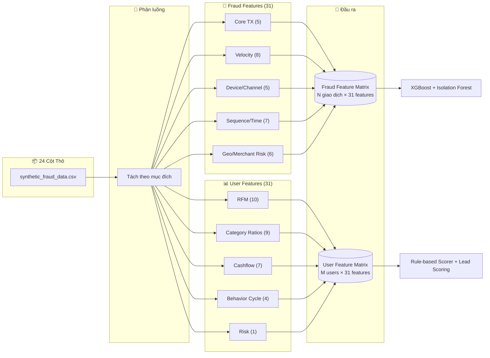

# BÁO CÁO LỰA CHỌN BỘ DỮ LIỆU & THIẾT KẾ ĐẶC TRƯNG

---

## 1. DATASET

### 1.1. Dataset đã chọn

| Thuộc tính | Giá trị |
|---|---|
| **Tên** | `synthetic_fraud_data.csv` |
| **Nguồn** | Kaggle — Ismat Samadov |
| **License** | Apache 2.0 |
| **Kích thước** | ~2.93 GB |
| **Định dạng** | CSV (giao dịch synthetic) |

### 1.2. Các cột dữ liệu thô (24 cột)

| # | Cột | Kiểu | Mô tả |
|---|---|---|---|
| 1 | `transaction_id` | TEXT | Khóa chính — định danh duy nhất mỗi giao dịch |
| 2 | `customer_id` | TEXT | Định danh người dùng — gộp nhóm theo user |
| 3 | `card_number` | TEXT | Số thẻ (ẩn danh) |
| 4 | `timestamp` | TIMESTAMP | Thời gian giao dịch — core cho velocity, RFM, sequence |
| 5 | `merchant_category` | TEXT | Danh mục merchant — **sống còn** cho Recommendation |
| 6 | `merchant_type` | TEXT | Phân loại merchant chi tiết hơn |
| 7 | `merchant` | TEXT | Tên merchant cụ thể |
| 8 | `amount` | FLOAT | Số tiền giao dịch — core feature |
| 9 | `currency` | TEXT | Đơn vị tiền tệ |
| 10 | `country` | TEXT | Quốc gia — geo-anomaly, demographic proxy |
| 11 | `city` | TEXT | Thành phố |
| 12 | `city_size` | TEXT | Quy mô thành phố (small/medium/large) |
| 13 | `card_type` | TEXT | Loại thẻ (credit/debit/prepaid) |
| 14 | `card_present` | BOOL | Thẻ có mặt tại POS? — card-not-present fraud |
| 15 | `device` | TEXT | Loại thiết bị (mobile/desktop/tablet) |
| 16 | `channel` | TEXT | Kênh giao dịch (mobile_app/web/atm/pos) |
| 17 | `device_fingerprint` | TEXT | Vân tay thiết bị — phát hiện Account Takeover |
| 18 | `ip_address` | TEXT | Địa chỉ IP — geo-anomaly, IP change |
| 19 | `distance_from_home` | FLOAT | Khoảng cách từ nhà — geo-anomaly |
| 20 | `high_risk_merchant` | BOOL | Merchant có rủi ro cao? |
| 21 | `transaction_hour` | INT | Giờ giao dịch (0-23) — night transaction detection |
| 22 | `weekend_transaction` | BOOL | Giao dịch cuối tuần? |
| 23 | `velocity_last_hour` | INT | Số giao dịch trong 1 giờ qua (tính sẵn) |
| 24 | `is_fraud` | BOOL | **Nhãn fraud 0/1** — bắt buộc cho supervised learning |

### 1.3. Đánh giá mức độ đáp ứng cho Fraud + Recommendation

| Yêu cầu | Fraud Detection | Recommendation | Trạng thái |
|---|---|---|---|
| Nhãn `is_fraud` (0/1) | ✅ Train XGBoost | ✅ Lọc user gian lận | **Có** |
| `merchant_category` đa dạng | ✅ Hành vi bất thường theo category | ✅ **Sống còn** — 9 category ratios + 2 behavior features | **Có** |
| `timestamp` | ✅ Velocity, sequence (~20 features) | ✅ RFM, recency (~10 features) | **Có** |
| `amount` | ✅ Core feature | ✅ Core feature | **Có** |
| `customer_id` | ✅ Gộp nhóm user | ✅ User profile | **Có** |
| `device` / `device_fingerprint` | ✅ Account Takeover (3/7 rule) | — | **Có** |
| `card_present` | ✅ Card-not-present fraud (#1 vector) | — | **Có** |
| `country`, `city`, `city_size` | ✅ Geo-anomaly | ✅ Demographic proxy, cold start | **Có** |
| `channel` | ✅ Channel switch anomaly | ✅ Behavior pattern | **Có** |
| `ip_address` | ✅ IP change, multi-account | — | **Có** |
| `distance_from_home` | ✅ Geo-anomaly (tính sẵn) | — | **Có** |
| `high_risk_merchant` | ✅ Risk signal (tính sẵn) | — | **Có** |
| `velocity_last_hour` | ✅ Velocity signal (tính sẵn) | — | **Có** |
| **`balance_before/after`** | ⚠️ Balance anomaly | — | **Thiếu** |

> **Kết luận:** Dataset đáp ứng **23/24 cột** cần thiết. Thiếu duy nhất `balance_before/after` — ảnh hưởng ~15% độ chính xác với loại fraud "rút cạn tài khoản". Khắc phục bằng cách ước lượng từ `amount` + `transaction_type` và dùng `amount_zscore` thay cho `amount_to_balance_ratio`.

### 1.4. Đánh đổi & cách xử lý

| Hạn chế | Ảnh hưởng | Cách xử lý |
|---|---|---|
| Thiếu `balance_before/after` | Giảm ~15% độ chính xác với fraud "rút cạn tài khoản" | Ước lượng từ `amount` + `transaction_type`; dùng `amount_zscore` thay `amount_to_balance_ratio` |
| Dữ liệu synthetic | Không phải giao dịch thật 100% | Đủ cho MVP; thay thế bằng dữ liệu thật khi vận hành |
| Dung lượng ~2.93 GB | Cần máy đủ RAM | Sample 30–50% hoặc dùng Polars/chunking |
| Không có nhãn cho Recommendation | Cần tự tạo nhãn | Pseudo-label từ Rule-based Scorer dựa trên `merchant_category` |

---

## 2. FEATURES — TỪ DỮ LIỆU THÔ ĐẾN ĐẶC TRƯNG HỌC MÁY

Hệ thống thiết kế **hai bộ đặc trưng riêng biệt** cho hai pipeline:

- **Fraud Features (31 features/giao dịch):** Tính real-time tại thời điểm giao dịch đến, input cho Rule-based Filter → Isolation Forest → XGBoost.
- **User Features (31 features/user):** Tổng hợp định kỳ từ toàn bộ lịch sử giao dịch, input cho Recommendation Scorer → Lead Scoring.

---

### 2.1. FRAUD FEATURES — 31 đặc trưng / giao dịch

Dùng để mô hình học **hành vi bất thường** và **rủi ro gian lận** của từng giao dịch đơn lẻ.

#### A. Core Transaction (5 features)

| # | Feature | Mô tả | Từ cột gốc |
|---|---|---|---|
| F1 | `amount` | Số tiền giao dịch | `amount` |
| F2 | `amount_log` | Log-transform của amount (giảm skew) | `amount` |
| F3 | `amount_zscore` | Z-score của amount so với trung bình user 30 ngày | `amount` + `customer_id` + `timestamp` |
| F4 | `amount_vs_avg_ratio` | `amount / avg_amount_30d` — gấp bao nhiêu lần trung bình | `amount` + `customer_id` |
| F5 | `amount_vs_max_ratio` | `amount / max_amount_90d` — so với đỉnh lịch sử | `amount` + `customer_id` |

#### B. Velocity Features (8 features)

Đo **tốc độ & tần suất** giao dịch — indicator mạnh cho fraud.

| # | Feature | Mô tả | Từ cột gốc |
|---|---|---|---|
| F6 | `tx_count_1h` | Số giao dịch trong 1 giờ qua | `timestamp` + `customer_id` |
| F7 | `tx_count_6h` | Số giao dịch trong 6 giờ qua | `timestamp` + `customer_id` |
| F8 | `tx_count_24h` | Số giao dịch trong 24 giờ qua | `timestamp` + `customer_id` |
| F9 | `tx_amount_sum_1h` | Tổng tiền giao dịch trong 1 giờ | `amount` + `timestamp` + `customer_id` |
| F10 | `tx_amount_sum_24h` | Tổng tiền giao dịch trong 24 giờ | `amount` + `timestamp` + `customer_id` |
| F11 | `velocity_last_hour` | Số giao dịch 1 giờ qua **(tính sẵn)** | `velocity_last_hour` |
| F12 | `frequency_deviation` | `(tx_count_24h - avg_tx_24h_30d) / std_tx_24h_30d` | `timestamp` + `customer_id` |
| F13 | `amount_velocity_1h` | Tổng amount / phút trong 1 giờ qua | `amount` + `timestamp` |

#### C. Device & Channel (5 features)

Phát hiện **Account Takeover** và **thay đổi kênh bất thường**.

| # | Feature | Mô tả | Từ cột gốc |
|---|---|---|---|
| F14 | `device_change_count_7d` | Số thiết bị khác nhau trong 7 ngày | `device_fingerprint` + `timestamp` + `customer_id` |
| F15 | `ip_change_count_7d` | Số IP khác nhau trong 7 ngày | `ip_address` + `timestamp` + `customer_id` |
| F16 | `new_device_flag` | 0/1: thiết bị chưa từng được user này dùng | `device_fingerprint` + `customer_id` |
| F17 | `channel_switch_flag` | 0/1: kênh giao dịch khác với kênh thường dùng | `channel` + `customer_id` |
| F18 | `multiple_accounts_same_device` | Số `customer_id` khác dùng cùng `device_fingerprint` | `device_fingerprint` + `customer_id` |

#### D. Sequence / Time Features (7 features)

Bắt **bất thường về thời điểm** và **chuỗi giao dịch**.

| # | Feature | Mô tả | Từ cột gốc |
|---|---|---|---|
| F19 | `time_since_last_tx` | Giây từ giao dịch trước đó của cùng user | `timestamp` + `customer_id` |
| F20 | `hour_of_day` | Giờ giao dịch (0-23) | `transaction_hour` |
| F21 | `day_of_week` | Thứ trong tuần (0=Mon, 6=Sun) | `timestamp` |
| F22 | `is_night_transaction` | 0/1: giao dịch 22h-6h | `transaction_hour` |
| F23 | `is_weekend` | 0/1: giao dịch cuối tuần | `weekend_transaction` |
| F24 | `tx_sequence_position` | Giao dịch thứ mấy trong ngày của user | `timestamp` + `customer_id` |
| F25 | `avg_time_between_txs` | Khoảng cách trung bình giữa các giao dịch (giây) | `timestamp` + `customer_id` |

#### E. Geo & Merchant Risk (6 features)

Tận dụng dữ liệu **địa lý** và **merchant rủi ro** có sẵn.

| # | Feature | Mô tả | Từ cột gốc |
|---|---|---|---|
| F26 | `distance_from_home` | Khoảng cách từ nhà **(tính sẵn)** | `distance_from_home` |
| F27 | `high_risk_merchant` | Merchant rủi ro cao? **(tính sẵn)** | `high_risk_merchant` |
| F28 | `card_present` | Thẻ có mặt? **(tính sẵn)** | `card_present` |
| F29 | `geo_anomaly_flag` | 0/1: country/city khác thường so với lịch sử user | `country` + `city` + `customer_id` |
| F30 | `merchant_category_anomaly` | 0/1: merchant_category chưa từng xuất hiện với user này | `merchant_category` + `customer_id` |
| F31 | `large_amount_night_flag` | 0/1: giao dịch đêm + amount > 3× trung bình | `amount` + `transaction_hour` + `customer_id` |

> **Tổng: 31 fraud features.** Input cho 3 tầng fraud detection: 7 Rule-based Filter → Isolation Forest (200 trees) → XGBoost Classifier (300 trees, SMOTE).

---

### 2.2. USER FEATURES — 31 đặc trưng / user

Dùng để mô hình học **nhu cầu tài chính**, **hành vi chi tiêu**, và **mức độ phù hợp sản phẩm** của từng khách hàng.

#### A. RFM Features (10 features)

Đo **Recency, Frequency, Monetary** — khung phân tích khách hàng kinh điển.

| # | Feature | Mô tả | Từ cột gốc |
|---|---|---|---|
| U1 | `recency_days` | Số ngày từ giao dịch gần nhất đến hôm nay | `timestamp` + `customer_id` |
| U2 | `frequency_7d` | Số giao dịch trong 7 ngày | `timestamp` + `customer_id` |
| U3 | `frequency_30d` | Số giao dịch trong 30 ngày | `timestamp` + `customer_id` |
| U4 | `frequency_90d` | Số giao dịch trong 90 ngày | `timestamp` + `customer_id` |
| U5 | `monetary_7d` | Tổng tiền giao dịch 7 ngày | `amount` + `timestamp` + `customer_id` |
| U6 | `monetary_30d` | Tổng tiền giao dịch 30 ngày | `amount` + `timestamp` + `customer_id` |
| U7 | `monetary_90d` | Tổng tiền giao dịch 90 ngày | `amount` + `timestamp` + `customer_id` |
| U8 | `avg_transaction_amount` | Giá trị giao dịch trung bình (toàn bộ lịch sử) | `amount` + `customer_id` |
| U9 | `max_transaction_amount` | Giá trị giao dịch lớn nhất từ trước đến nay | `amount` + `customer_id` |
| U10 | `std_transaction_amount` | Độ lệch chuẩn giá trị giao dịch | `amount` + `customer_id` |

#### B. Category Ratios (9 features)

**Tỷ trọng chi tiêu** theo từng danh mục (0-1) — core cho Recommendation engine.

| # | Feature | Mô tả | Từ cột gốc |
|---|---|---|---|
| U11 | `shopping_ratio` | Tỷ trọng mua sắm | `amount` + `merchant_category` + `customer_id` |
| U12 | `travel_ratio` | Tỷ trọng du lịch | `amount` + `merchant_category` + `customer_id` |
| U13 | `food_ratio` | Tỷ trọng ăn uống | `amount` + `merchant_category` + `customer_id` |
| U14 | `education_ratio` | Tỷ trọng giáo dục | `amount` + `merchant_category` + `customer_id` |
| U15 | `healthcare_ratio` | Tỷ trọng y tế | `amount` + `merchant_category` + `customer_id` |
| U16 | `entertainment_ratio` | Tỷ trọng giải trí | `amount` + `merchant_category` + `customer_id` |
| U17 | `cashout_ratio` | Tỷ trọng rút tiền mặt | `amount` + `merchant_category` + `customer_id` |
| U18 | `transfer_ratio` | Tỷ trọng chuyển khoản | `amount` + `merchant_category` + `customer_id` |
| U19 | `loan_payment_ratio` | Tỷ trọng trả góp / vay | `amount` + `merchant_category` + `customer_id` |

```python
# Cách tính Category Ratios
category_amount = df.pivot_table(
    index="customer_id", columns="merchant_category",
    values="amount", aggfunc="sum", fill_value=0
)
category_ratio = category_amount.div(category_amount.sum(axis=1), axis=0)
```

#### C. Cashflow Features (7 features)

Đo **dòng tiền vào/ra** — phát hiện nhu cầu vay, thấu chi, tiết kiệm.

| # | Feature | Mô tả | Từ cột gốc |
|---|---|---|---|
| U20 | `income_total_30d` | Tổng tiền nhận vào 30 ngày | `amount` + `timestamp` + `customer_id` |
| U21 | `expense_total_30d` | Tổng tiền chi ra 30 ngày | `amount` + `timestamp` + `customer_id` |
| U22 | `net_cashflow_30d` | `income - expense` — dòng tiền ròng | U20 − U21 |
| U23 | `negative_cashflow_days` | Số ngày dòng tiền âm trong 30 ngày | `amount` + `timestamp` + `customer_id` |
| U24 | `end_month_negative_flag` | 0/1: 5 ngày cuối tháng có dòng tiền âm | `amount` + `timestamp` + `customer_id` |
| U25 | `balance_volatility` | Độ biến động số dư (ước lượng từ amount) | `amount` + `customer_id` |
| U26 | `salary_detected_flag` | 0/1: phát hiện lương (tiền vào đều hàng tháng ~same day, ~same amount) | `amount` + `timestamp` + `customer_id` |

#### D. Behavior Cycle Features (4 features)

Đo **mẫu hành vi theo thời gian** — weekend, night, travel frequency.

| # | Feature | Mô tả | Từ cột gốc |
|---|---|---|---|
| U27 | `weekend_spending_ratio` | Tỷ trọng chi tiêu cuối tuần / tổng chi tiêu | `weekend_transaction` + `amount` + `customer_id` |
| U28 | `night_transaction_ratio` | Tỷ trọng giao dịch ban đêm (22h-6h) | `transaction_hour` + `customer_id` |
| U29 | `travel_frequency_90d` | Số giao dịch du lịch trong 90 ngày | `merchant_category` + `timestamp` + `customer_id` |
| U30 | `shopping_frequency_30d` | Số giao dịch mua sắm trong 30 ngày | `merchant_category` + `timestamp` + `customer_id` |

#### E. Risk (1 feature)

| # | Feature | Mô tả | Từ cột gốc |
|---|---|---|---|
| U31 | `risk_score` | Điểm rủi ro tín dụng (0-1), tổng hợp từ fraud_score + behavior | `is_fraud` + fraud model output |

> **Tổng: 31 user features.** Input cho Recommendation Scorer (6 sản phẩm × weighted formula) và Lead Scoring (5 thành phần trọng số).

---

### 2.3. Feature Engineering Pipeline



---

### 2.4. Ma trận Feature × Pipeline

| Nhóm Feature | Số lượng | Fraud Detection | Recommendation | Lead Scoring |
|---|---|---|---|---|
| Core Transaction | 5 | ✅ Input chính | — | — |
| Velocity | 8 | ✅ Input chính (Rule F02, F05) | — | — |
| Device & Channel | 5 | ✅ Input chính (Rule F03) | — | — |
| Sequence / Time | 7 | ✅ Input chính (Rule F04) | — | — |
| Geo & Merchant Risk | 6 | ✅ Input chính (Rule F01, F06, F07) | — | — |
| RFM | 10 | — | ✅ `recency`, `frequency`, `monetary` | ✅ `monetary_90d` percentile |
| Category Ratios | 9 | — | ✅ Core — quyết định sản phẩm nào | ✅ `product_match_score` |
| Cashflow | 7 | — | ✅ Phát hiện nhu cầu vay/thấu chi/tiết kiệm | ✅ `propensity_score` |
| Behavior Cycle | 4 | — | ✅ `travel_frequency`, `shopping_frequency` | — |
| Risk | 1 | — | ✅ Filter sản phẩm rủi ro cao | ✅ Filter Hot lead |

---

## 3. KIẾN NGHỊ

| Hạng mục | Quyết định |
|---|---|
| Dataset chính | `synthetic_fraud_data.csv` (Transactions, Apache 2.0) |
| Dataset phụ | Không cần cho MVP |
| Tổng features | **62 features** (31 Fraud + 31 User) từ 24 cột thô |
| Xử lý dữ liệu | Sample 30–50% nếu máy yếu; chuẩn hóa `merchant_category` |
| Nhãn Recommendation | Pseudo-label từ Rule-based Scorer |
| Mở rộng sau MVP | PaySim nếu cần `balance_before/after`; dữ liệu thật khi vận hành |


