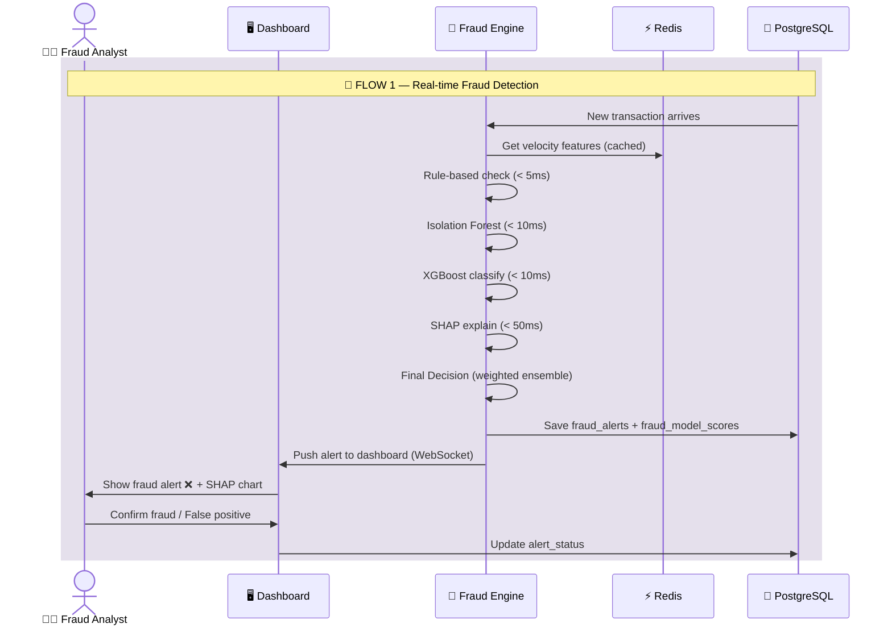
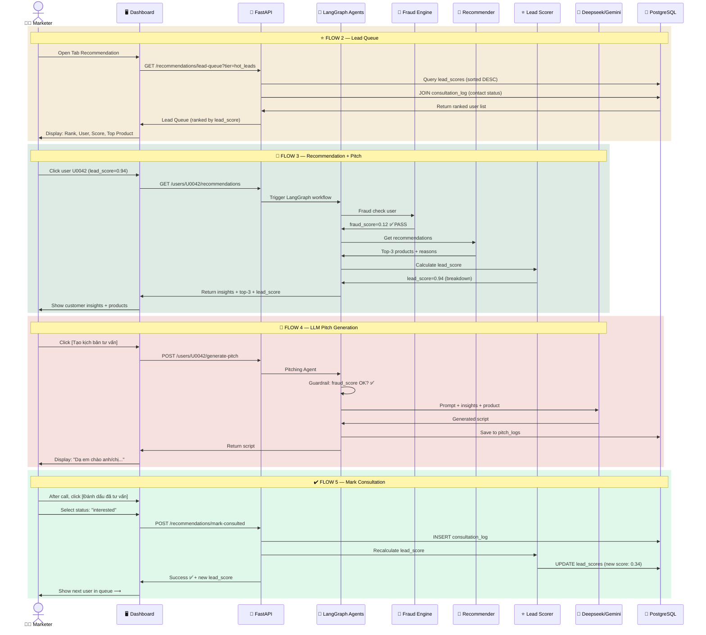
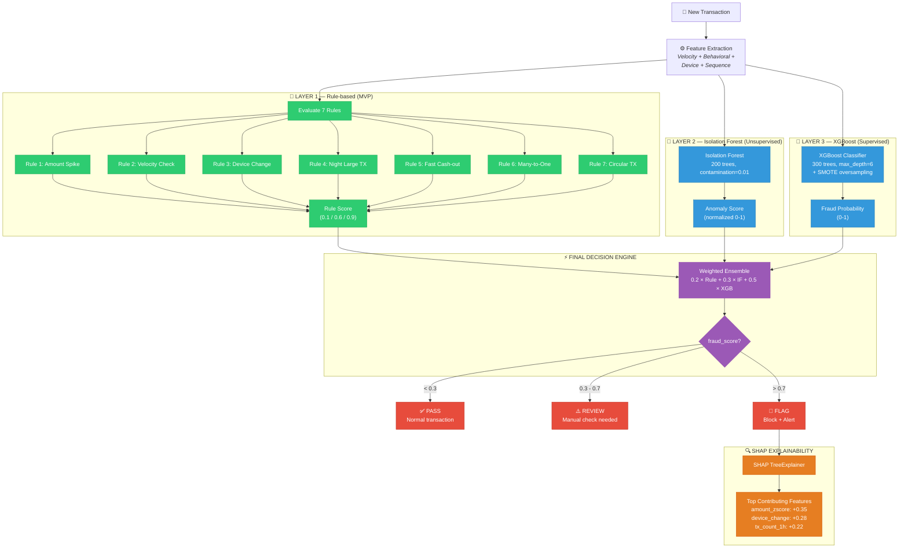
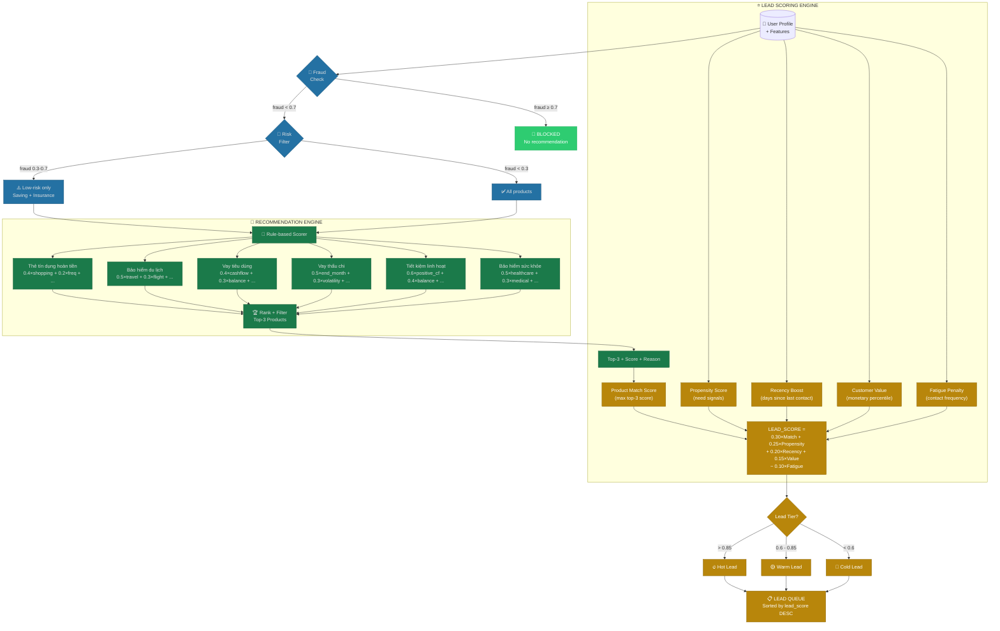
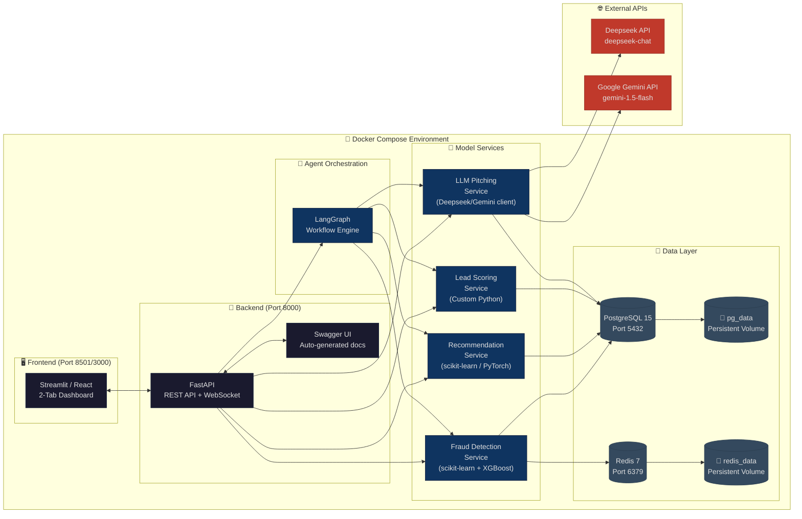
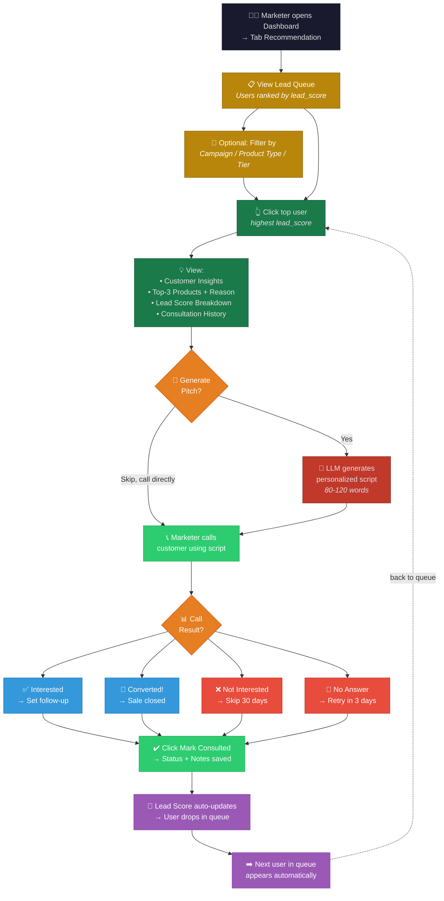

# Kiến trúc hệ thống — AI Phân tích Giao dịch Toàn diện

> **Phát hiện Gian lận, Dự báo Rủi ro Tín dụng và Khuyến nghị Sản phẩm Tài chính Cá nhân hóa**

---

## 1. Sơ đồ kiến trúc tổng thể (High-Level Architecture)

```mermaid
flowchart TB
    %% ── Styles ──
    classDef datasource fill:#1a1a2e,stroke:#16213e,color:#e0e0e0
    classDef datalayer fill:#0f3460,stroke:#16213e,color:#e0e0e0
    classDef fraudlayer fill:#533483,stroke:#3a2568,color:#e0e0e0
    classDef reclayer fill:#1b7a4a,stroke:#145c38,color:#e0e0e0
    classDef leadlayer fill:#b8860b,stroke:#8b6508,color:#fff
    classDef llmlayer fill:#c0392b,stroke:#922b21,color:#e0e0e0
    classDef agentlayer fill:#2c3e50,stroke:#1a252f,color:#e0e0e0
    classDef apilayer fill:#2471a3,stroke:#1a5276,color:#e0e0e0
    classDef dashboard fill:#1a1a2e,stroke:#16213e,color:#e0e0e0
    classDef db fill:#34495e,stroke:#2c3e50,color:#e0e0e0
    classDef decision fill:#e67e22,stroke:#d35400,color:#fff
    classDef block fill:#c0392b,stroke:#922b21,color:#fff

    %% ── Data Sources ──
    subgraph DATA_SRC["📦 DATA SOURCES"]
        direction TB
        raw_db[("🗄️ Raw Transaction DB<br/>(transaction_id, user_id,<br/>amount, merchant_category,<br/>device_id, ip_address, ...)")]
    end

    %% ── Layer 1: Data Preparation ──
    subgraph L1["🔧 LAYER 1 — Data Preparation"]
        direction TB
        cleaning["🧹 Data Cleaning<br/><i>Drop duplicates, normalize<br/>categories, handle missing</i>"]
        feat_eng["⚙️ Feature Engineering<br/><i>RFM + Category Ratio<br/>+ Cashflow + Cycle</i>"]
        fraud_feat["⚙️ Fraud Feature Engineering<br/><i>Velocity + Behavioral Deviation<br/>+ Device/Channel + Graph</i>"]

        cleaning --> feat_eng
        cleaning --> fraud_feat
    end

    %% ── Feature Stores ──
    subgraph FEAT_STORE["🗂️ FEATURE STORES"]
        direction LR
        user_feat[("📊 User-Feature<br/>Matrix")]
        fraud_feat_store[("🔴 Fraud-Feature<br/>Matrix")]
    end

    feat_eng --> user_feat
    fraud_feat --> fraud_feat_store

    %% ── Layer 2: Fraud Detection ──
    subgraph L2["🚨 LAYER 2 — Fraud Detection Engine"]
        direction TB
        rule_fraud["📏 Rule-based Filter<br/><i>7 Hard Rules<br/>(Amount Spike, Velocity,<br/>Device Change, Fast Cash-out,<br/>Many-to-One, Circular...)</i>"]
        iso_forest["🌲 Isolation Forest<br/><i>Unsupervised Anomaly<br/>Detection</i>"]
        xgboost["🚀 XGBoost Classifier<br/><i>Supervised Fraud<br/>Classification + SMOTE</i>"]
        shap["🔍 SHAP Explainer<br/><i>Explainable AI —<br/>Top Contributing Features</i>"]
        decision["⚡ Final Decision Engine<br/><i>Weighted Ensemble<br/>(Rule + IF + XGBoost)</i>"]

        rule_fraud --> decision
        iso_forest --> decision
        xgboost --> decision
        decision --> shap
    end

    fraud_feat_store --> rule_fraud
    fraud_feat_store --> iso_forest
    fraud_feat_store --> xgboost

    %% ── Decision Gate ──
    decision_gate{"🛑 FRAUD GATE<br/>fraud_score?"}
    decision --> decision_gate

    %% ── Layer 3: Recommendation ──
    subgraph L3["🎯 LAYER 3 — Recommendation Engine"]
        direction TB
        rec_rule["📐 Rule-based Scorer<br/><i>Score từng product<br/>theo behavior</i>"]
        rec_filter["🔎 Fraud + Risk Filter<br/><i>Loại sản phẩm rủi ro cao<br/>nếu fraud_score > 0.3</i>"]
        top3["🏆 Top-3 Products<br/><i>+ Reason + Score</i>"]

        rec_rule --> rec_filter --> top3
    end

    user_feat --> rec_rule
    decision_gate -- "fraud < 0.7" --> rec_filter
    decision_gate -- "fraud ≥ 0.7" --> block_rec["🚫 BLOCK<br/>Không gợi ý<br/>sản phẩm"]

    %% ── Layer 3.5: Lead Scoring ──
    subgraph L35["⭐ LAYER 3.5 — Lead Scoring & Prioritization"]
        direction TB
        lead_calc["📊 Lead Score Calculator<br/><i>5 Components Weighted<br/>ProductMatch + Propensity<br/>+ Recency + Value − Fatigue</i>"]
        lead_queue["📋 Lead Queue Builder<br/><i>Sort + Filter + Paginate<br/>Hot / Warm / Cold Tiers</i>"]
        campaign["📢 Campaign Filter<br/><i>product_type, tier,<br/>min_lead_score</i>"]

        lead_calc --> lead_queue
        campaign --> lead_queue
    end

    top3 --> lead_calc
    user_feat --> lead_calc

    %% ── Layer 4: Agent Orchestration ──
    subgraph L4["🤖 LAYER 4 — Agentic Orchestration (LangGraph)"]
        direction TB
        data_agent["📡 Data Agent<br/><i>Fetch user profile<br/>+ transaction history</i>"]
        fraud_agent["🚨 Fraud Detection Agent<br/><i>Score + Flag + SHAP</i>"]
        rec_agent["🎯 Recommendation Agent<br/><i>Top-3 + Reason</i>"]
        lead_agent["⭐ Lead Score Agent<br/><i>Calculate + Update<br/>lead_score</i>"]
        pitch_agent["💬 Pitching Agent<br/><i>Generate script<br/>via Deepseek/Gemini</i>"]
        format_agent["📝 Response Formatter<br/><i>Normalize JSON<br/>for Frontend</i>"]

        data_agent --> fraud_agent
        fraud_agent --> rec_agent
        rec_agent --> lead_agent
        lead_agent --> pitch_agent
        pitch_agent --> format_agent
    end

    decision_gate -- "fraud < 0.3" --> pitch_agent
    decision_gate -- "fraud ≥ 0.3" --> format_agent

    %% ── Layer 5: LLM ──
    subgraph L5["🧠 LAYER 5 — LLM Pitching Bot"]
        direction TB
        guardrail["🛡️ Safety Guardrail<br/><i>Fraud check + content filter<br/>No sensitive info</i>"]
        prompt["📝 Prompt Template<br/><i>Customer insights<br/>+ Product + Reason</i>"]
        llm_api[("🌐 Deepseek / Gemini API<br/><i>80-120 words<br/>Natural + Professional</i>")]
        fallback["🔄 Fallback Template<br/><i>Rule-based script<br/>if LLM timeout</i>"]

        guardrail --> prompt
        prompt --> llm_api
        llm_api -- "timeout" --> fallback
    end

    pitch_agent --> guardrail

    %% ── Layer 6: API ──
    subgraph L6["🔌 LAYER 6 — FastAPI Backend"]
        direction LR
        api_fraud["POST /fraud/score"]
        api_rec["GET /recommendations/{user_id}"]
        api_lead["GET /recommendations/lead-queue"]
        api_mark["POST /recommendations/mark-consulted"]
        api_pitch["POST /users/{user_id}/generate-pitch"]
        api_feedback["POST /fraud/feedback"]
    end

    decision --> api_fraud
    top3 --> api_rec
    lead_queue --> api_lead
    lead_queue --> api_mark
    format_agent --> api_pitch
    format_agent --> api_feedback

    %% ── Databases ──
    subgraph DATABASES["💾 DATABASES (PostgreSQL + Redis Cache)"]
        direction LR
        db_txn[("transactions")]
        db_user[("user_features")]
        db_fraud[("fraud_alerts<br/>fraud_model_scores")]
        db_prod[("product_catalog")]
        db_consult[("consultation_log<br/>lead_scores<br/>marketing_campaigns")]
        db_pitch[("pitch_logs<br/>recommendation_logs")]
        cache[("⚡ Redis Cache<br/>(real-time velocity<br/>features)")]
    end

    raw_db --> db_txn
    user_feat --> db_user
    decision --> db_fraud
    top3 --> db_prod
    lead_queue --> db_consult
    llm_api --> db_pitch
    fraud_feat_store --> cache

    %% ── Dashboard ──
    subgraph DASH["🖥️ DASHBOARD (Streamlit / React)"]
        direction LR
        subgraph TAB1["🚨 Tab: Fraud Detection"]
            direction TB
            gauge["⭕ Fraud Score Gauge<br/><i>Green / Yellow / Red</i>"]
            alerts_panel["🔔 Fraud Alerts Panel<br/><i>severity-coded list</i>"]
            shap_chart["📊 SHAP Waterfall Chart<br/><i>Feature contribution</i>"]
            timeline["📅 Suspicious TX Timeline"]
            confirm_btn["✅ Confirm Fraud / ❌ False Positive"]
        end

        subgraph TAB2["🎯 Tab: Recommendation"]
            direction TB
            lead_table["📋 Lead Queue Table<br/><i>Ranked by Lead Score</i>"]
            campaign_filter["🔽 Campaign / Product Filter"]
            insights["💡 Customer Insights<br/><i>Spending chart + Risk</i>"]
            top3_card["🏆 Top-3 Products Card<br/><i>+ Score + Reason</i>"]
            pitch_btn["🎤 Generate Pitch Button"]
            mark_btn["✔️ Mark as Consulted<br/><i>interested / not / converted</i>"]
        end
    end

    api_fraud --> gauge
    api_fraud --> alerts_panel
    api_fraud --> shap_chart
    api_fraud --> timeline
    api_feedback --> confirm_btn
    api_lead --> lead_table
    api_lead --> campaign_filter
    api_rec --> insights
    api_rec --> top3_card
    api_pitch --> pitch_btn
    api_mark --> mark_btn

    %% ── Users ──
    fraud_analyst["👨‍💻 Fraud Analyst<br/><i>Review alerts,<br/>confirm/false-positive</i>"]
    marketer["👩‍💼 Marketer / Telesales<br/><i>View Lead Queue,<br/>call customers,<br/>mark consulted</i>"]

    fraud_analyst --> TAB1
    marketer --> TAB2

    %% ── Apply styles ──
    class raw_db datasource
    class cleaning,feat_eng,fraud_feat datalayer
    class user_feat,fraud_feat_store db
    class rule_fraud,iso_forest,xgboost,shap,decision fraudlayer
    class rec_rule,rec_filter,top3 reclayer
    class lead_calc,lead_queue,campaign leadlayer
    class guardrail,prompt,llm_api,fallback llmlayer
    class data_agent,fraud_agent,rec_agent,lead_agent,pitch_agent,format_agent agentlayer
    class api_fraud,api_rec,api_lead,api_mark,api_pitch,api_feedback apilayer
    class decision_gate decision
    class block_rec block
    class db_txn,db_user,db_fraud,db_prod,db_consult,db_pitch,cache db
    class TAB1,TAB2 dashboard
```



---

## 2. Sơ đồ luồng dữ liệu (Data Flow)

### 2.1. Luồng Fraud Detection (Real-time)



### 2.2. Luồng Recommendation + Lead Queue + Pitching



---

## 3. Sơ đồ Fraud Detection (Chi tiết)



---

## 4. Sơ đồ Recommendation + Lead Scoring (Chi tiết)



---

## 5. Sơ đồ triển khai (Deployment)



---

## 6. Quy trình làm việc của Marketer (Marketer Workflow)



---

## 7. Cấu trúc thư mục dự án

```text
ai-transaction-analyzer/
│
├── data/
│   ├── raw/                          # Dữ liệu giao dịch thô
│   ├── processed/                    # Dữ liệu đã làm sạch
│   ├── product_catalog.csv           # Danh mục sản phẩm tài chính
│   └── fraud_labels.csv              # Label gian lận (nếu có)
│
├── notebooks/
│   ├── 01_eda.ipynb                  # Exploratory Data Analysis
│   ├── 02_feature_engineering.ipynb  # Feature engineering
│   ├── 03_model_experiment.ipynb     # Thử nghiệm model
│   └── 04_fraud_detection.ipynb      # Fraud detection analysis
│
├── src/
│   ├── data/
│   │   ├── cleaning.py               # Làm sạch & chuẩn hóa dữ liệu
│   │   └── feature_engineering.py    # Feature engineering chung
│   │
│   ├── fraud/                        # 🚨 Fraud Detection Module
│   │   ├── feature_engineering.py    # Fraud-specific features
│   │   ├── rule_based.py             # Rule-based fraud detector (7 rules)
│   │   ├── model.py                  # ML models (Isolation Forest, XGBoost)
│   │   ├── scoring.py                # Real-time scoring pipeline
│   │   ├── explainer.py              # SHAP-based explainability
│   │   └── service.py                # Fraud detection service
│   │
│   ├── recommender/                  # 🎯 Recommendation Module
│   │   ├── rule_based.py             # Rule-based recommender
│   │   ├── model.py                  # ML ranking model
│   │   └── service.py                # Recommendation service
│   │
│   ├── lead_scoring/                 # ⭐ Lead Scoring Module
│   │   ├── lead_score.py             # Lead Score calculation (5 components)
│   │   ├── propensity.py             # Propensity score estimation
│   │   ├── lead_queue.py             # Lead Queue builder + filter + sort
│   │   └── campaign.py               # Campaign configuration & targeting
│   │
│   ├── risk/
│   │   └── risk_scoring.py           # Credit risk scoring
│   │
│   ├── llm/                          # 🧠 LLM Module
│   │   ├── prompt_template.py        # Prompt templates
│   │   └── llm_service.py            # Deepseek/Gemini API client
│   │
│   ├── agents/                       # 🤖 Agent Orchestration
│   │   ├── graph.py                  # LangGraph workflow definition
│   │   ├── data_agent.py             # Data fetching agent
│   │   ├── fraud_agent.py            # Fraud detection agent
│   │   ├── recommendation_agent.py   # Recommendation agent
│   │   ├── lead_score_agent.py       # Lead scoring agent
│   │   ├── lead_queue_agent.py       # Lead queue agent
│   │   └── pitching_agent.py         # LLM pitching agent
│   │
│   └── api/                          # 🔌 FastAPI Backend
│       ├── main.py                   # App entry point
│       ├── routes.py                 # API route definitions
│       ├── fraud_routes.py           # Fraud detection endpoints
│       ├── lead_routes.py            # Lead Queue + mark-consulted endpoints
│       └── schemas.py                # Pydantic models / request-response schemas
│
├── dashboard/
│   └── app.py                        # 🖥️ Streamlit/React dashboard (2 tabs)
│
├── tests/
│   ├── test_features.py              # Unit test: feature engineering
│   ├── test_fraud.py                 # Unit test: fraud detection
│   ├── test_recommender.py           # Unit test: recommendation
│   ├── test_lead_scoring.py          # Unit test: lead scoring
│   └── test_api.py                   # Integration test: API endpoints
│
├── models/                           # 💾 Saved models
│   ├── isolation_forest.pkl
│   ├── xgboost_fraud.json
│   └── recommender.pkl
│
├── configs/                          # ⚙️ Configuration files
│   ├── fraud_rules.json              # Fraud rule definitions
│   ├── product_catalog.json          # Product catalog
│   ├── lead_score_weights.json       # Lead Score weights (w1-w5)
│   └── campaigns.json                # Campaign configurations
│
├── docker/
│   ├── Dockerfile                    # Application Docker image
│   ├── docker-compose.yml            # Multi-container orchestration
│   └── .env.example                  # Environment variables template
│
├── requirements.txt                  # Python dependencies
├── README.md                         # Project documentation
└── Makefile                          # Common commands (run, test, deploy)
```

---


## 8. Công nghệ sử dụng (Tech Stack)

| Tầng | Công nghệ | Mục đích |
|---|---|---|
| **Data Processing** | Pandas, NumPy | Làm sạch, feature engineering |
| **Fraud Detection** | scikit-learn (Isolation Forest), XGBoost, SHAP | Phát hiện gian lận + giải thích |
| **Recommendation** | scikit-learn / PyTorch | Gợi ý sản phẩm |
| **Lead Scoring** | Custom Python (NumPy) | Tính lead_score, xếp hạng user |
| **LLM Integration** | deepseek / google-generativeai | Sinh kịch bản tư vấn |
| **Agent Orchestration** | LangGraph | Điều phối workflow |
| **Backend API** | FastAPI, Uvicorn | REST API + WebSocket |
| **Database** | PostgreSQL 15, Redis 7 | Lưu trữ + cache |
| **Frontend** | Streamlit / React + Tailwind | Dashboard 2 tab |
| **Visualization** | Plotly, Matplotlib | Biểu đồ SHAP, gauge, timeline |
| **Deployment** | Docker, Docker Compose | Containerization |
| **Monitoring** | Prometheus, Grafana (future) | Giám sát latency, error rate |
